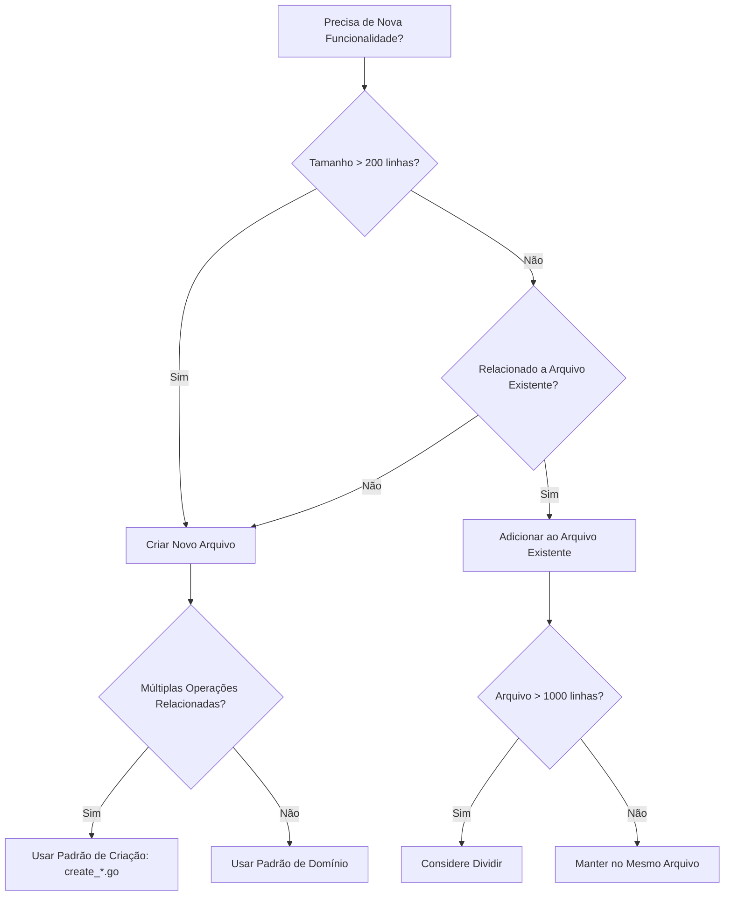
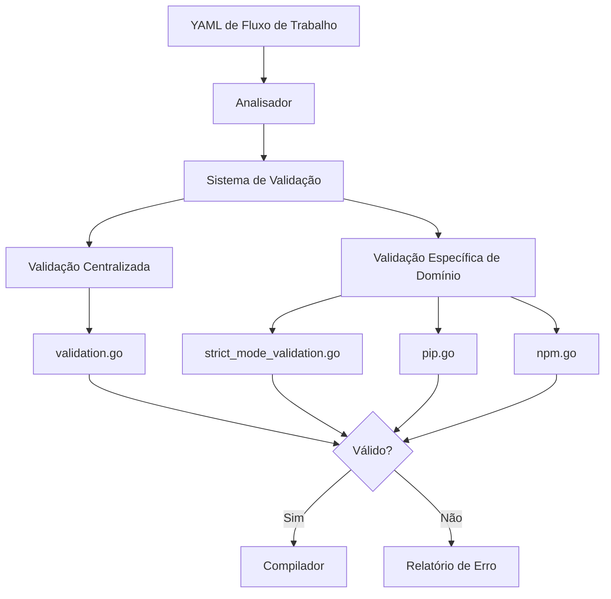
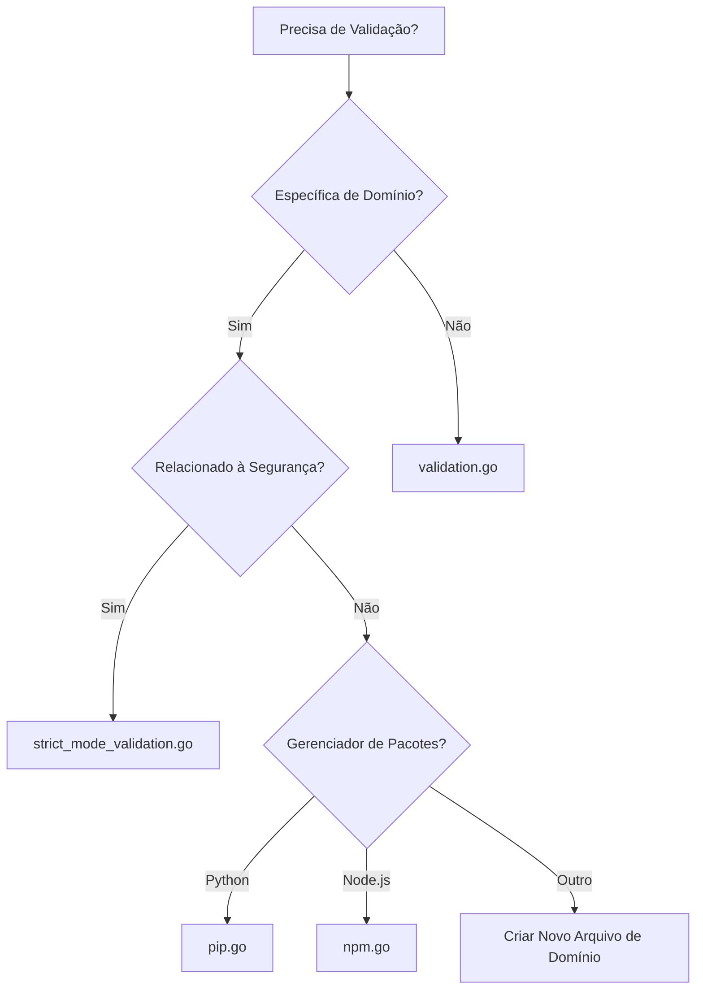
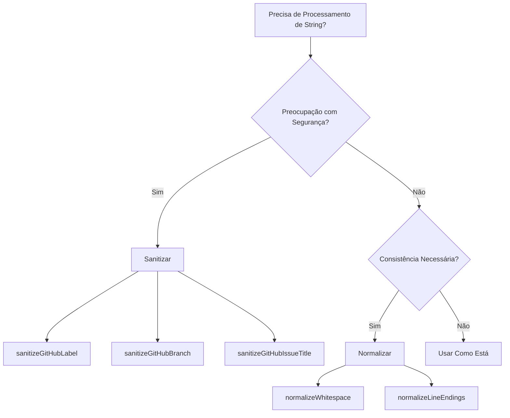
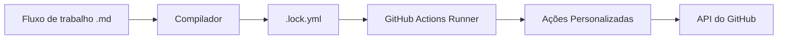

# Instruções para o Desenvolvedor

Diretrizes de desenvolvimento, padrões arquiteturais e padrões de implementação para Fluxos de Trabalho Agentic do GitHub.

---

## Padrões de Organização de Código

### Padrões Recomendados

#### 1. Padrão de Funções de Criação (`create_*.go`)

**Padrão**: Um arquivo por operação de criação de entidade do GitHub

**Exemplos**:
- `create_issue.go` - Lógica de criação de issue do GitHub
- `create_pull_request.go` - Lógica de criação de pull request
- `create_discussion.go` - Lógica de criação de discussão
- `create_code_scanning_alert.go` - Criação de alerta de verificação de código
- `create_agent_task.go` - Lógica de criação de tarefa de agente

#### 2. Padrão de Separação de Engine

**Padrão**: Cada engine de IA tem seu próprio arquivo com auxiliares compartilhados em `engine_helpers.go`

**Exemplos**:
- `copilot_engine.go` — Engine GitHub Copilot
- `claude_engine.go` — Engine Claude
- `codex_engine.go` — Engine Codex
- `custom_engine.go` — Suporte a engine personalizada
- `engine_helpers.go` — Utilitários de engine compartilhados

#### 3. Padrão de Organização de Testes

**Padrão**: Testes residem junto aos arquivos de implementação com nomes descritivos

**Exemplos**:
- Testes de funcionalidade: `feature.go` + `feature_test.go`
- Testes de integração: `feature_integration_test.go`
- Testes de cenário específico: `feature_scenario_test.go`

### Árvore de Decisão para Criação de Arquivo



### Diretrizes de Tamanho de Arquivo

- **Pequeno (50-200 linhas)**: Utilitários, auxiliares, funcionalidades simples
- **Médio (200-500 linhas)**: Lógica específica de domínio, funcionalidades focadas
- **Grande (500-1000 linhas)**: Funcionalidades complexas, implementações abrangentes
- **Muito Grande (1000+ linhas)**: Considere dividir se não for coeso
---

## Arquitetura de Validação

A validação garante que as configurações de fluxo de trabalho estejam corretas antes da compilação. Dois padrões:

1. **Validação centralizada** — `validation.go`
2. **Validação específica de domínio** — arquivos dedicados

### Fluxo de Validação



### Validação Centralizada: `pkg/workflow/validation.go`

Validação de propósito geral em todo o sistema de fluxo de trabalho:

- `validateExpressionSizes()` — limites de tamanho de expressão do GitHub Actions
- `validateContainerImages()` — imagens Docker existem e são acessíveis
- `validateRuntimePackages()` — dependências de pacotes de runtime
- `validateGitHubActionsSchema()` — esquema YAML do GitHub Actions
- `validateNoDuplicateCacheIDs()` — identificadores de cache únicos
- `validateSecretReferences()` — sintaxe de referência de segredo
- `validateRepositoryFeatures()` — capacidades do repositório (issues, discussões)

### Validação Específica de Domínio

#### Modo Estrito: `strict_mode_validation.go`

Impõe restrições de segurança e proteção no modo estrito:

- `validateStrictMode()` — orquestrador principal do modo estrito
- `validateStrictPermissions()` — recusa permissões de escrita
- `validateStrictNetwork()` — requer configuração de rede explícita
- `validateStrictMCPNetwork()` — requer configuração de rede em servidores MCP personalizados
- `validateStrictBashTools()` — recusa ferramentas bash com wildcards

#### Validação de Pacotes

- **Python/pip**: `pip.go` — disponibilidade de pacote no PyPI
- **Node.js/npm**: `npm.go` — pacotes npm usados com npx

### Onde Adicionar Validação


---

## Padrões de Desenvolvimento

### Diretrizes de Capitalização

**Regras**:
- **Nome do Produto**: "GitHub Agentic Workflows" (sempre capitalize)
- **Nomes de Funcionalidade**: Use a sentença em minúsculo (ex: "safe output messages")
- **Nomes de Arquivo**: Use minúsculo com hifens (ex: `code-organization.md`)
- **Elementos de Código**: Siga convenções da linguagem (ex: `camelCase` em JavaScript, `snake_case` em Python)
### Regras para Alterações Incompatíveis (Breaking Changes)

**Alterações Incompatíveis**:
- Remover ou renomear comandos CLI, flags ou opções
- Alterar comportamento padrão do qual os usuários dependem
- Remover suporte para formatos de configuração
- Alterar códigos de saída ou mensagens de erro que ferramentas analisam

**Alterações Compatíveis**:
- Adicionar novas flags ou comandos opcionais
- Adicionar novos formatos de saída
- Refatoração interna com o mesmo comportamento externo
- Adicionar novos recursos que não afetam a funcionalidade existente
---

## Processamento de String

### Sanitizar vs Normalizar



**Sanitizar** — substituir caracteres que causam problemas de segurança ou quebram restrições da API do GitHub:
- `sanitizeGitHubLabel()` — labels atendem aos requisitos do GitHub (sem emoji, limites de comprimento)
- `sanitizeGitHubBranch()` — nomes de branch em relação às regras de ref do Git
- `sanitizeGitHubIssueTitle()` — títulos de issue evitam caracteres problemáticos

**Normalizar** — padronizar formato para consistência, sem implicações de segurança:
- `normalizeWhitespace()` — espaços em branco (espaços, tabs, quebras de linha)
- `normalizeLineEndings()` — CRLF para LF
- `normalizeMarkdown()` — formatação markdown
---

## Manipulação de YAML

### Gotchas do YAML 1.1 vs 1.2

**Problema Crítico**: O GitHub Actions usa YAML 1.1, mas muitas bibliotecas YAML de Go usam YAML 1.2 por padrão

**Principais Diferenças**:
- Palavra-chave `on`: YAML 1.1 trata como booleano `true`, YAML 1.2 trata como string
- `yes`/`no`: YAML 1.1 trata como booleanos, YAML 1.2 trata como strings
- Números octais: Regras de análise diferentes

**Solução**: Use a biblioteca `goccy/go-yaml` que suporta YAML 1.1

```go
import "github.com/goccy/go-yaml"

// Analisa YAML 1.1 corretamente
var workflow map[string]interface{}
err := yaml.Unmarshal(data, &workflow)
```

**Palavras-chave afetadas**:
- Gatilhos de fluxo de trabalho: `on`, `push`, `pull_request`
- Valores booleanos: `yes`, `no`, `true`, `false`, `on`, `off`
- Valores nulos: `null`, `~`
---

## Mensagens de Saída Segura (Safe Output)

Comunicação estruturada entre agentes de IA e operações da API do GitHub.

### Categorias de Mensagem

| Categoria | Propósito | Rodapé | Exemplo |
|----------|---------|--------|---------|
| **Issues** | Criar/atualizar issues | Com número da issue | `> AI gerado por [Workflow](url) para #123` |
| **Pull Requests** | Criar/atualizar PRs | Com número do PR | `> AI gerado por [Workflow](url) para #456` |
| **Discussões** | Criar discussões | Com número da discussão | `> AI gerado por [Workflow](url)` |
| **Comentários** | Adicionar comentários | Ciente do contexto | `> AI gerado por [Workflow](url) para #123` |

### Indicador de Modo Staged

🎭 marca o modo de visualização em todos os tipos de saída segura.

### Estrutura da Mensagem

```yaml
safe_outputs:
  create_issue:
    title: "Título da issue"
    body: |
      ## Descrição

      Conteúdo aqui

      ---
      > AI gerado por [WorkflowName](run_url)
```
---

## Ações Personalizadas do GitHub

### Arquitetura



### Sistema de Construção

Implementado em Go em `pkg/cli/actions_build_command.go`. Sem scripts de construção JavaScript.

**Comandos principais**:
- `make actions-build` - Constrói todas as ações personalizadas
- `make actions-validate` - Valida configuração da ação
- `make actions-clean` - Limpa artefatos de construção

**Estrutura de diretórios**:
```
actions/
└── setup/
    ├── action.yml
    ├── setup.sh
    ├── js/
    └── sh/
```
---

## Melhores Práticas de Segurança

### Prevenção de Injeção de Template

**Regra Chave**: Nunca interpole diretamente a entrada do usuário em expressões do GitHub Actions ou comandos shell

**Padrão Vulnerável**:
```yaml
# ❌ NÃO SEGURO - Entrada do usuário em expressão
- run: echo "Título: ${{ github.event.issue.title }}"
```

**Padrão Seguro**:
```yaml
# ✅ SEGURO - Use variáveis de ambiente
- env:
    TITLE: ${{ github.event.issue.title }}
  run: echo "Título: ${TITLE}"
```

### Segurança do GitHub Actions

**Melhores Práticas**:
- Sempre fixe ações a commits SHA específicos, não tags
- Use permissões mínimas com bloco `permissions:`
- Valide todas as entradas externas
- Nunca registre segredos ou tokens
- Use o OIDC do GitHub para autenticação em nuvem

**Exemplo**:
```yaml
permissions:
  contents: read
  issues: write
  pull-requests: write

steps:
  - uses: actions/checkout@a1b2c3d4... # SHA fixado
```
---

## Framework de Testes

### Tipos de Teste

| Tipo de Teste | Propósito | Localização | Frequência de Execução |
|-----------|---------|----------|---------------|
| **Testes Unitários** | Testar funções individuais | `*_test.go` | Cada commit |
| **Testes de Integração** | Testar interações de componentes | `*_integration_test.go` | Pré-mesclagem |
| **Testes de Regressão de Segurança** | Prevenir problemas de segurança | `security_regression_test.go` | Cada commit |
| **Testes de Fuzz** | Encontrar casos extremos | `*_fuzz_test.go` | Contínuo |
| **Testes de Benchmark** | Rastreamento de desempenho | `*_benchmark_test.go` | Pré-lançamento |

### Testes de Regressão Visual

Arquivos golden capturam a saída de console esperada para tabelas, caixas, árvores e formatação de erros.

**Comandos de Teste Golden**:
```bash
# Executar testes golden
go test -v ./pkg/console -run='^TestGolden_'

# Atualizar arquivos golden (apenas quando alterar a saída intencionalmente)
make update-golden
```

**Quando Atualizar Arquivos Golden**:
- ✅ Melhorando intencionalmente a formatação da saída do console
- ✅ Corrigindo bugs visuais na renderização
- ✅ Adicionando novas colunas ou campos a tabelas
- ❌ Testes falham inesperadamente durante o desenvolvimento
- ❌ Fazendo alterações de código não relacionadas
---

## Sistema Repo-Memory

Armazenamento persistente baseado em git para agentes de IA entre execuções de fluxo de trabalho. Mantém o estado em branches de git dedicadas com sincronização automática.

### Visão Geral da Arquitetura

```mermaid
graph TD
    A[Início do Job do Agente] --> B[Clonar branch memory/{id}]
    B --> C[Agente lê/escreve arquivos]
    C --> D[Upload de artefato: repo-memory-{id}]
    D --> E[Executar Job do Repo Memory]
    E --> F[Baixar artefato]
    F --> G[Validar arquivos]
    G --> H[Commit para memory/{id}]
    H --> I[Push para repositório]
```

### Convenções de Caminho

| Padrão | Formato | Exemplo | Propósito |
|---------|--------|---------|---------|
| **Diretório de Memória** | `/tmp/gh-aw/repo-memory/{id}` | `/tmp/gh-aw/repo-memory/default` | Diretório de runtime para o agente |
| **Nome do Artefato** | `repo-memory-{id}` | `repo-memory-default` | Artefato do GitHub Actions |
| **Nome da Branch** | `memory/{id}` | `memory/default` | Branch git para armazenamento |

### Fluxo de Dados

1. **Clonar**: clone a branch `memory/{id}` para o diretório local
2. **Execução**: o agente lê/escreve arquivos no diretório de memória
3. **Upload**: faça upload do diretório como artefato do GitHub Actions
4. **Baixar**: baixe o artefato e valide restrições
5. **Push**: envie para a branch `memory/{id}` e faça push

### Configuração Chave

```yaml
repo-memory:
  - id: default
    create-orphan: true
    allow-artifacts: true

  - id: orchestration
    create-orphan: true
    max-file-size: 1MB
    max-files: 100
```

**Restrições de Validação**: tamanho máximo de arquivo, contagem máxima de arquivos, padrões permitidos/bloqueados, rastreamento de tamanho/contagem em mensagens de commit.
---

## Gerenciamento Hierárquico de Agentes

Fluxos de trabalho de meta-orquestração gerenciam múltiplos agentes e fluxos de trabalho em escala.

### Papéis do Meta-Orquestrador

| Papel | Arquivo | Propósito | Agendamento |
|------|------|---------|----------|
| **Gerente de Saúde do Fluxo de Trabalho** | `workflow-health-manager.md` | Monitorar saúde do fluxo de trabalho | Diário |
| **Analisador de Desempenho do Agente** | `agent-performance-analyzer.md` | Analisar qualidade do agente | Diário |
---

## Gerenciamento de Versão

### Changesets

Documente alterações e gerencie versionamento:

```bash
# Criar um changeset
npx changeset

# Lançar nova versão
npx changeset version
npx changeset publish
```

**Formato do Changeset**:
```markdown
---
"gh-aw": patch
---

Breve descrição da alteração
```

**Tipos de Versão**:
- **major**: Alterações incompatíveis
- **minor**: Novos recursos (compatíveis retroativamente)
- **patch**: Correções de bugs e melhorias menores

### Testes de Funcionalidade Ponta a Ponta

1. Use `.github/workflows/dev.md` como fluxo de trabalho de teste
2. Adicione cenários de teste como comentários no PR
3. Dev Hawk analisará e verificará o comportamento
4. Não mescle alterações de `dev.md` — ele permanece como um ambiente de teste reutilizável
---

## Dicas de Escopo para Fluxos de Trabalho Complexos

Forneça restrições concretas antecipadamente para evitar timeouts do agente e saídas vagas.

### Regra Geral

> Quanto mais restrições você fornecer antecipadamente, mais rápido e preciso será o fluxo de trabalho gerado.

### Orientação de Tipo de Fluxo de Trabalho

| Tipo de Fluxo de Trabalho | Restrições Chave a Especificar |
|---------------|---------------------------|
| **Análise de arquivo** | Formato do arquivo (lcov, cobertura, jacoco, etc.) e caminho |
| **Diff entre branches** | Estratégia de branch (nomes base/head, ex: `main`/`feature`) |
| **Relatórios** | Formato de saída (markdown, JSON, HTML) |
| **Análise de cobertura** | Limite de cobertura (ex: 80%), local do relatório |
| **Auditoria de dependência** | Gerenciador de pacotes (npm, pip, cargo), filtro de severidade |
| **Benchmarks de desempenho** | Ferramenta de benchmark, métrica a rastrear, limite de regressão |

### Exemplos

#### ✅ Restrito (mais rápido, mais preciso)

```
Crie um fluxo de trabalho que lê um relatório de cobertura lcov de `coverage/lcov.info`
e comenta em PRs se a cobertura cair abaixo de 80%.
```

```
Crie um fluxo de trabalho que faz diff entre `main` e a branch head do PR, lista arquivos
Go alterados e posta um resumo em markdown como comentário de PR.
```

```
Crie um fluxo de trabalho que executa `npm audit --json`, filtra resultados para
vulnerabilidades de alta severidade e falha na verificação se alguma for encontrada.
```

#### ⚠️ Irrestrito (pode causar timeout ou saída vaga)

```
Crie um fluxo de trabalho que monitora a cobertura de testes.
```

```
Crie um fluxo de trabalho que verifica vulnerabilidades de dependência.
```

```
Crie um fluxo de trabalho que compara branches e relata diferenças.
```

### Lista de Verificação de Prevenção de Timeout

Antes de enviar uma solicitação de fluxo de trabalho complexa, confirme:

- [ ] **Caminho e formato do arquivo de entrada** — ex: `coverage/lcov.info` no formato lcov
- [ ] **Evento de disparo** — ex: `pull_request`, `push to main`, `schedule`
- [ ] **Critério de sucesso/falha** — ex: cobertura ≥ 80%, zero CVEs de alta severidade
- [ ] **Destino de saída** — ex: comentário de PR, issue, notificação Slack, artefato
- [ ] **Limites de escopo** — ex: apenas arquivos alterados, apenas diretório `src/`
---

## Protocolo de Deduplicação de PR

Tentativas repetidas de PR fechados sobre o mesmo tópico desperdiçam CI e contexto. Execute este protocolo antes de cada PR.

### Verificação de PR Duplicado Pré-voo

Procure por PRs fechados existentes com um tópico semelhante usando a ferramenta GitHub MCP `search_pull_requests`:

1. Extraia 2–4 palavras-chave do título da funcionalidade/correção.
2. Execute uma pesquisa como:
   - `is:pr is:closed head:copilot/ <palavras-chave>`
   - `is:pr is:closed <palavras-chave>`
3. Se nenhum for encontrado, prossiga normalmente.
4. Se um ou mais forem encontrados, execute a [Análise de Falha Prévia](#análise-de-falha-prévia) antes de escrever qualquer código.

### Análise de Falha Prévia

Quando existir um PR fechado sobre o mesmo tópico, faça isso no início da sessão — antes de qualquer exploração de código:

1. Leia a descrição do PR fechado, comentários de revisão e cronograma.
2. Identifique a **causa raiz do fechamento**:
   - Revisor solicitou alterações → liste-as explicitamente
   - Falhas de CI/teste → identifique verificações com falha e causa raiz
   - Incompatibilidade de escopo → esclareça o que foi realmente solicitado
   - Duplicado de outra correção → link para essa correção
3. Verifique se a causa raiz será abordada na nova implementação.
4. Inclua uma seção "## Tentativas Prévias" na nova descrição do PR que resuma:
   - Link(s) para PR(s) fechado(s) anterior(es)
   - Por que cada um foi fechado
   - O que é diferente desta vez

**Exemplo de seção de descrição de PR:**

```markdown
## Tentativas Prévias

- #1234 (fechado): CI falhou em `TestFoo` devido a falta de verificação de nil — corrigido neste PR
- #1189 (fechado): Revisor solicitou redução de escopo — este PR limita a alteração apenas a X
```

### Disjuntor de Limite de Tentativa (Retry Limit)

Se existirem **dois ou mais** PRs fechados sobre o mesmo tópico:

1. **Não abra um terceiro PR** sem revisão humana explícita.
2. Poste um comentário na issue original que:
   - Liste todos os PRs fechados anteriormente e seus motivos de fechamento
   - Explique o que mudou (se algo mudou) na nova abordagem
   - Solicite aprovação explícita do mantenedor para prosseguir
3. Rotule a issue `copilot-retry-blocked` para sinalizar que a revisão humana é necessária.
4. Aguarde um mantenedor remover o rótulo ou deixar um comentário de aprovação antes de criar o novo PR.

**Justificativa:** Duas tentativas consecutivas de PR falhas indicam um problema sistêmico (requisitos pouco claros, contexto ausente, problema fundamental de design) que mudanças de código sozinhas não podem resolver.

---

### Locais de Arquivo

| Funcionalidade | Arquivo de Implementação | Arquivo de Teste |
|---------|-------------------|-----------|
| Validação | `pkg/workflow/validation.go` | `pkg/workflow/validation_test.go` |
| Saídas Seguras | `pkg/workflow/safe_outputs.go` | `pkg/workflow/safe_outputs_test.go` |
| Processamento de String | `pkg/workflow/strings.go` | `pkg/workflow/strings_test.go` |
| Construção de Ações | `pkg/cli/actions_build_command.go` | `pkg/cli/actions_build_command_test.go` |
| Validação de Esquema | `pkg/parser/schemas/` | Vários arquivos de teste |

### Padrões Comuns

**Criando um novo manipulador de entidade do GitHub**:
1. Crie `create_<entidade>.go` em `pkg/workflow/`
2. Implemente a função `Create<Entidade>()`
3. Adicione validação em `validation.go` ou arquivo específico de domínio
4. Crie o arquivo de teste correspondente
5. Atualize mensagens de saída segura

**Adicionando nova validação**:
1. Determine se centralizada ou específica de domínio
2. Adicione função de validação no arquivo apropriado
3. Chame do orquestrador de validação principal
4. Adicione testes para casos válidos e inválidos
5. Documente regras de validação

**Adicionando nova engine**:
1. Crie `<engine>_engine.go` em `pkg/workflow/`
2. Implemente interface de engine
3. Use `engine_helpers.go` para funcionalidade compartilhada
4. Adicione testes específicos da engine
5. Registre a engine na fábrica de engines

---

**Última Atualização**: 2026-04-28
