import { Aside } from '@astrojs/starlight/components';

O GitHub Agentic Workflows implementa uma arquitetura de segurança de defesa em profundidade que protege contra servidores Model Context Protocol (MCP) não confiáveis e agentes comprometidos. Este documento fornece uma visão geral do nosso modelo de segurança e diagramas visuais dos principais componentes.

## Modelo de Segurança

O Agentic Workflows (AW) adota uma abordagem em camadas que combina isolamento imposto pelo substrato, especificação declarativa e execução em etapas. Cada camada impõe propriedades de segurança distintas sob diferentes suposições e restringe o impacto de falhas acima dela.

### Modelo de Ameaças

Consideramos um adversário que possa comprometer componentes não confiáveis de nível de usuário, por exemplo, contêineres, e que possa fazê-los comportar-se arbitrariamente dentro dos privilégios concedidos a eles. O adversário pode tentar:

- Acessar ou corromper a memória ou o estado de outros componentes
- Comunicar-se através de canais não intencionais
- Abusar de canais legítimos para realizar ações não intencionais
- Confundir a lógica de controle de nível superior desviando dos fluxos de trabalho esperados

Assumimos que o adversário não compromete o hardware subjacente ou primitivas criptográficas. Ataques explorando canais laterais e canais ocultos também estão fora do escopo.

---

### Camada 1: Confiança em Nível de Substrato

Os AWs executam em uma máquina virtual (VM) de runner do GitHub Actions e confiam nos mecanismos de imposição de hardware e nível de kernel do GitHub Actions, incluindo CPU, MMU, kernel e runtime de contêiner. Os AWs também confiam em três contêineres privilegiados: (1) um firewall de rede que tem a confiança para configurar a conectividade para outros componentes via `iptables` e iniciar o contêiner do agente, (2) um proxy de API que roteia o tráfego do modelo e pode manter credenciais específicas do endpoint ou configuração de roteamento para engines suportadas, e (3) um Gateway MCP que tem a confiança para configurar e gerar contêineres de servidor MCP isolados. Coletivamente, o nível de substrato garante o isolamento de memória entre componentes, isolamento de CPU e recursos, mediação de operações privilegiadas e chamadas de sistema, e limites de comunicação explicitamente impostos pelo kernel. Essas garantias permanecem válidas mesmo se um componente não confiável de nível de usuário for totalmente comprometido e executar código arbitrário. Violações de confiança no nível do substrato exigem vulnerabilidades no firewall, Gateway MCP, runtime de contêiner, kernel, hipervisor ou hardware. Se esta camada falhar, as garantias de segurança de nível superior podem não ser válidas.

---

### Camada 2: Confiança em Nível de Configuração

O AW confia em artefatos de configuração declarativos, por exemplo, passos de Action, políticas de firewall de rede, configurações de servidor MCP e as cadeias de ferramentas que os interpretam para instanciar corretamente a estrutura e conectividade do sistema. O nível de configuração restringe quais componentes são carregados, como os componentes são conectados, quais canais de comunicação são permitidos e quais privilégios de componente são atribuídos. Tokens de autenticação cunhados externamente, por exemplo, chaves de API do agente e tokens de acesso do GitHub, são um insumo de configuração crítico e são tratados como capacidades importadas que limitam os efeitos externos dos componentes; a configuração declarativa controla sua distribuição, por exemplo, quais tokens são carregados em quais contêineres. Violações de segurança surgem devido a configurações incorretas, especificações excessivamente permissivas e limitações do modelo declarativo. Esta camada define quais componentes existem e como eles se comunicam, mas não restringe como os componentes usam esses canais ao longo do tempo.

---

### Camada 3: Confiança em Nível de Plano

O AW confia adicionalmente na confiança em nível de plano para restringir o comportamento do componente ao longo do tempo. Nesta camada, o compilador confiável decompõe um fluxo de trabalho em etapas (stages). Para cada etapa, o plano especifica (1) quais componentes estão ativos e suas permissões, (2) os dados produzidos pela etapa e (3) como esses dados podem ser consumidos por etapas subsequentes. Em particular, a confiança em nível de plano garante que efeitos colaterais externos importantes sejam explícitos e passem por uma verificação completa.

Uma instância primária da confiança em nível de plano é o subsistema **SafeOutputs**. SafeOutputs é um conjunto de componentes confiáveis que operam no estado externo. Um agente pode interagir com servidores MCP somente leitura, por exemplo, o servidor MCP do GitHub, mas escritas externalizadas, como criar pull requests no GitHub, são armazenadas em buffer como artefatos pelo SafeOutputs em vez de aplicadas imediatamente. Quando o agente termina, os artefatos em buffer do SafeOutputs podem ser processados por uma sequência determinística de filtros e análises definidas por configuração. Essas verificações podem incluir restrições estruturais, por exemplo, limitar o número de pull requests, imposição de políticas e higienização automatizada para garantir que informações sensíveis, como tokens de autenticação, não sejam exportadas. Esses artefatos filtrados e transformados são passados para uma etapa subsequente na qual são externalizados.

Violações de segurança na camada de planejamento surgem de construção incorreta do plano, definições de etapa incompletas ou excessivamente permissivas, ou erros na imposição de transições de plano. Esta camada não protege contra falhas de isolamento em nível de substrato ou alocação incorreta de permissões no momento da cunhagem de credenciais ou configuração. No entanto, ela limita o raio de explosão de um componente comprometido à etapa na qual está ativo e sua influência nos artefatos passados para a próxima etapa.


## Visão Geral dos Componentes

A arquitetura de segurança opera em várias camadas: validação em tempo de compilação, isolamento em tempo de execução, separação de permissões, controles de rede e higienização de saída. O diagrama a seguir ilustra as relações entre esses componentes e o fluxo de dados através do sistema.

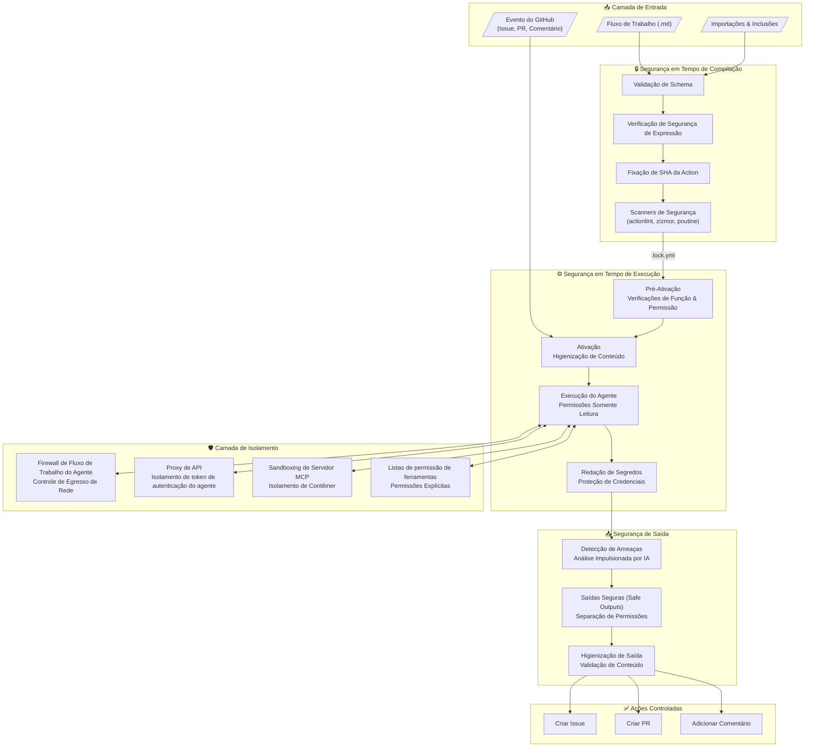

## Saídas Seguras: Isolamento de Permissões

O subsistema SafeOutputs impõe o isolamento de permissões garantindo que a execução do agente nunca tenha acesso direto de escrita ao estado externo. O job do agente executa com permissões mínimas de somente leitura, enquanto as operações de escrita são adiadas para jobs separados que executam somente após o agente concluir. Essa separação garante que mesmo um agente totalmente comprometido não possa modificar diretamente o estado do repositório.

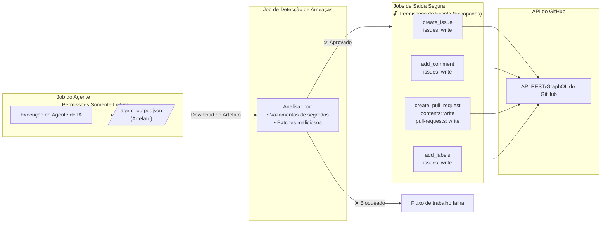

<Aside type="tip">
O subsistema SafeOutputs fornece segurança por design: o agente nunca requer permissões de escrita porque todas as operações de escrita são realizadas por jobs separados, validados e com permissões mínimas escopadas.
</Aside>

## Firewall de Fluxo de Trabalho do Agente (AWF)

O Firewall de Fluxo de Trabalho do Agente (AWF) coloca o agente em contêineres, vincula-o a uma rede Docker e usa iptables para redirecionar o tráfego HTTP/HTTPS através de um contêiner proxy Squid. O proxy Squid controla o tráfego de egresso do agente através de uma lista de permissões de domínio configurável para evitar exfiltração de dados e restringir agentes comprometidos a domínios permitidos. O processo de configuração do AWF descarta suas capacidades de iptables antes de iniciar o agente. 

Colocar um agente em contêineres melhora a segurança limitando seu acesso ao host, mas isso pode ter um custo. Em particular, muitos agentes de codificação esperam acesso total ao host e falham se colocados em contêineres de forma ingênua. Para suportar agentes que precisam de mais acesso ao host, o AWF fornece um 'chroot mode' mais permissivo que monta um subconjunto de diretórios do sistema host como somente leitura em '/host', monta os diretórios HOME e '/tmp' do host como leitura-gravação, importa um subconjunto de variáveis de ambiente do host como USER e PATH, e então inicia o agente em uma jail chroot '/host'. Isso permite que o agente use com segurança binários instalados no host (Python, Node.js, Go, etc.) a partir de seus caminhos normais, enquanto controla o acesso à rede do host, variáveis de ambiente e outros recursos sensíveis.

Assim, o AWF separa duas preocupações:
- **Sistema de arquivos**: Acesso controlado a binários e runtimes do host via chroot
- **Rede**: Todo tráfego roteado através de proxy impondo a lista de permissões de domínio

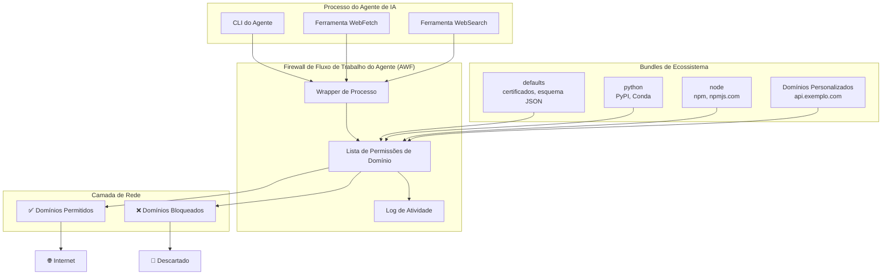

**Exemplo de Configuração:**

```yaml wrap
engine: copilot

network:
  firewall: true
  allowed:
    - defaults     # Infraestrutura básica
    - python       # Ecossistema PyPI
    - node         # Ecossistema npm
    - "api.exemplo.com"  # Domínio personalizado
```

## Gateway MCP e Integração com Firewall

Quando o gateway MCP está habilitado, ele opera em conjunto com o AWF para garantir que o tráfego MCP permaneça contido dentro de limites confiáveis. O gateway gera contêineres isolados para servidores MCP enquanto o AWF media todo o egresso de rede, garantindo que a comunicação agente-servidor atravesse apenas canais aprovados.

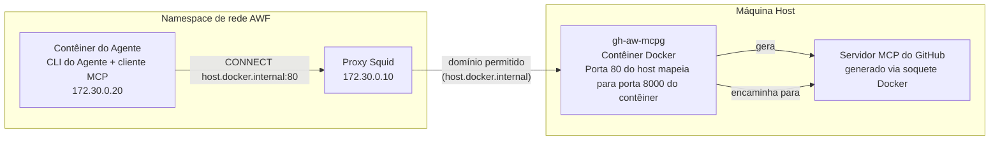

**Resumo da Arquitetura**

1. O AWF estabelece uma rede isolada com um proxy Squid que impõe a lista `network.allowed` do fluxo de trabalho.
2. O contêiner do agente só pode sair através do Squid. Para alcançar o gateway, ele usa `host.docker.internal:80` (alias do host do Docker). Este nome de host deve ser incluído na lista de permissões do firewall.
3. O contêiner `gh-aw-mcpg` publica a porta 80 do host mapeada para a porta 8000 do contêiner. Ele usa o soquete Docker para gerar contêineres de servidor MCP.
4. Todo o tráfego MCP permanece dentro do limite do host: o AWF restringe o egresso, e o gateway roteia solicitações para servidores MCP sandboxed.
5. Quando suportado por um agente, o AWF cria um `api-proxy` confiável que roteia o tráfego do modelo em nome do agente, mantendo esse tráfego atrás dos controles de rede do AWF. Este proxy não deve ser tratado como um limite de autenticação de chamador separado para código arbitrário já em execução dentro do contêiner do agente.

> [!WARNING]
> A chave de API do gateway MCP que é montada no contêiner do agente não é um limite de segurança forte contra um agente comprometido ou mal-intencionado. Um agente executando código arbitrário pode extrair a chave da memória do processo, estado de tempo de execução ou outros canais dentro do contêiner. Trate esta chave como vazada por design e confie no isolamento do substrato, política de rede e separação de permissões em estágios para segurança.

## Sandboxing de Servidor MCP

Servidores MCP executam dentro de contêineres isolados, impondo separação em nível de substrato entre o agente e cada instância de servidor. A filtragem de ferramentas em nível de configuração restringe quais operações cada servidor pode expor, limitando a superfície de ataque disponível para um agente comprometido. Esse isolamento garante que, mesmo que um servidor MCP seja comprometido, ele não possa acessar a memória ou estado de outros componentes.

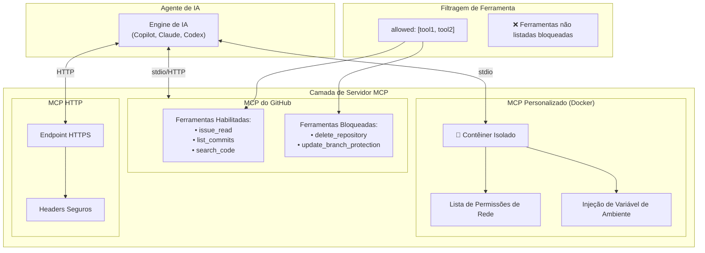

**Propriedades de Isolamento:**

- **Isolamento de Contêiner**: Servidores MCP personalizados executam em contêineres Docker sem estado compartilhado
- **Controles de Rede**: Listas de permissões de domínio por contêiner impostas via proxy Squid
- **Filtragem de Ferramentas**: Listas `allowed:` explícitas restringem operações disponíveis
- **Injeção de Segredos**: Segredos são passados via variáveis de ambiente, nunca em arquivos de configuração

## Pipeline de Detecção de Ameaças

O job de detecção de ameaças é uma sub-etapa dentro do subsistema SafeOutputs. Após o job do agente concluir e suas saídas serem armazenadas em buffer como artefatos, um job de detecção separado baixa esses artefatos e invoca um agente de IA instruído para analisá-los em busca de conteúdo suspeito. Este agente de detecção opera com um prompt de sistema focado em segurança e examina as saídas do agente, patches e contexto de execução. O job de detecção executa isolado do agente original e não tem acesso a permissões de escrita; sua única responsabilidade é emitir um veredito de aprovação/reprovação que autoriza os jobs de saída segura subsequentes.

As verificações de detecção incluem identificação de vazamento de segredos, padrões de código malicioso e violações de política. Se o agente de detecção identificar ameaças, o fluxo de trabalho é encerrado antes que qualquer escrita seja externalizada. Autores de fluxo de trabalho podem personalizar o comportamento de detecção fornecendo prompts de detecção adicionais ou integrando scanners de segurança externos.

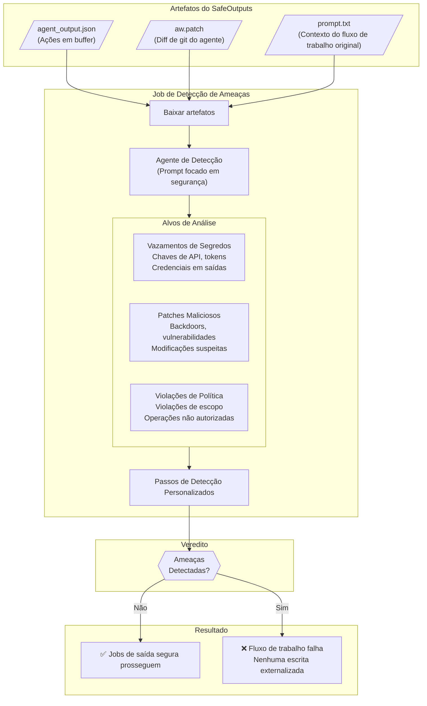

**Propriedades do Job de Detecção:**

- **Execução Isolada**: O agente de detecção executa em um job separado sem permissões de escrita e sem acesso ao estado de tempo de execução do agente original
- **Análise com Prompt**: A detecção usa a mesma engine de IA que o fluxo de trabalho, mas com um prompt de sistema focado em segurança que instrui o agente a identificar ameaças
- **Baseado em Artefatos**: O agente de detecção vê apenas os artefatos em buffer (saídas, patches, contexto), não o estado real do repositório
- **Veredito de Bloqueio**: O job de detecção deve concluir com sucesso e emitir um veredito "seguro" antes que qualquer job de saída segura execute

**Mecanismos de Detecção:**

- **Detecção de IA**: Análise padrão impulsionada por IA usando a engine de fluxo de trabalho com um prompt de detecção focado em segurança
- **Passos Personalizados**: Integração com scanners de segurança (Semgrep, TruffleHog, LlamaGuard) via configuração `threat-detection.steps`
- **Prompts Personalizados**: Instruções de detecção específicas de domínio para modelos de ameaça especializados via configuração `threat-detection.prompt`

**Exemplo de Configuração:**

```yaml wrap
threat-detection:
  prompt: |
    Adicionalmente verifique por:
    - Referências a URLs de infraestrutura interna
    - Tentativas de modificar arquivos de configuração de CI/CD
    - Alterações em arquivos sensíveis à segurança (.github/workflows, scripts do package.json)
  steps:
    - name: Executar TruffleHog
      run: trufflehog filesystem /tmp/gh-aw --only-verified
    - name: Executar Semgrep
      run: semgrep scan /tmp/gh-aw/aw.patch --config=auto
```

## Segurança em Tempo de Compilação

O AW impõe restrições de segurança em tempo de compilação através de validação de schema, permissão de expressões e fixação de ação. O compilador confiável valida artefatos de configuração declarativos antes de serem implantados, rejeitando configurações incorretas e especificações excessivamente permissivas. Esta camada restringe quais componentes podem ser carregados e como podem ser conectados, mas não restringe o comportamento em tempo de execução.

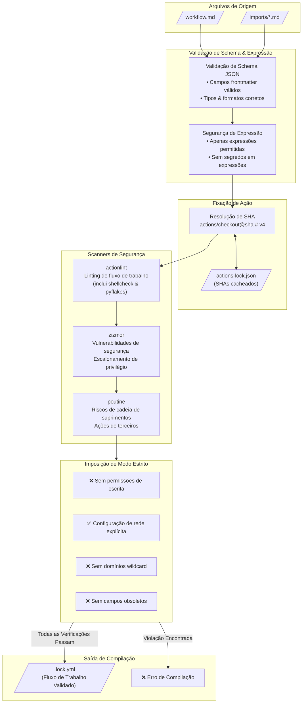

**Comandos de Compilação:**

```bash wrap
# Gere o arquivo de lock a partir do frontmatter do fluxo de trabalho, que inclui validação de schema,
# verificações de segurança de expressão, fixação de ação e verificação de segurança
gh aw compile

# Habilite scanners de segurança adicionais para validação extra
gh aw compile --actionlint --zizmor --poutine
```

## Higienização de Conteúdo

O conteúdo gerado pelo usuário é higienizado antes de ser passado ao agente. O pipeline de higienização aplica uma série de transformações para normalizar conteúdo potencialmente problemático. Este mecanismo opera no limite da etapa de ativação, garantindo que a entrada não confiável seja processada antes de ser passada para o agente.

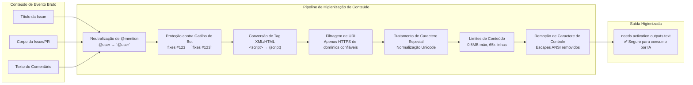

**Propriedades da Higienização:**

| Mecanismo | Entrada | Saída | Proteção |
|-----------|-------|--------|------------|
| **Neutralização de @mention** | `@user` | `` `@user` `` | Evita notificações de usuário não intencionais |
| **Proteção contra Gatilho de Bot** | `fixes #123` | `` `fixes #123` `` | Evita vinculação automática de issue |
| **Conversão de Tag XML/HTML** | `<script>` | `(script)` | Evita injeção via tags XML |
| **Filtragem de URI** | `http://evil.com` | `(redacted)` | Restringe a HTTPS de domínios confiáveis |
| **Caracteres Especiais** | Homóglifos Unicode | Normalizado | Evita ataques de spoofing visual |
| **Limites de Conteúdo** | Payloads grandes | Truncado | Impõe tamanho máx de 0.5MB, 65k linhas máx |
| **Caracteres de Controle** | Escapes ANSI | Removidos | Remove códigos de manipulação de terminal |

**Comportamento da Filtragem de URI:**

O mecanismo de filtragem de URI aplica uma validação rigorosa:

- ✅ **Permitido**: `https://github.com/...`, `https://api.github.com/...`
- ✅ **Permitido**: URLs de domínios explicitamente confiáveis na configuração
- ❌ **Bloqueado**: URLs `http://` (não-HTTPS)
- ❌ **Bloqueado**: URLs com padrões suspeitos
- ❌ **Bloqueado**: Data URLs, javascript: URLs
- ❌ **Bloqueado**: URLs de domínios não confiáveis → substituído por `(redacted)`

URLs aparecendo como `(redacted)` indicam que o domínio não estava na lista de permissões. Isso evita a potencial exfiltração de dados através de domínios não confiáveis. A lista de domínios permitidos é derivada da configuração `network:` do fluxo de trabalho e inclui domínios do GitHub por padrão.

**Tratamento de Tag XML/HTML:**

Tags XML e HTML são convertidas para um formato seguro de parênteses para evitar injeção:

```
<script>alert('xss')</script>  →  (script)alert('xss')(/script)
        →  (img src=x onerror=...)
<!-- comentário oculto -->        →  (!-- comentário oculto --)
```

## Filtragem de Integridade

A filtragem de integridade controla a qual conteúdo do GitHub um agente pode acessar durante uma execução de fluxo de trabalho, com base na **confiança do autor** e **status de merge** em vez de apenas no acesso de push. O gateway MCP intercepta chamadas de ferramenta e filtra o conteúdo abaixo do limite configurado de `min-integrity` antes que a engine de IA o veja — itens de usuários bloqueados ou abaixo do nível mínimo de confiança são removidos de forma transparente.

Para repositórios públicos, `min-integrity: approved` é aplicado automaticamente — restringindo o conteúdo a proprietários, membros e colaboradores — mesmo sem autenticação adicional. Os quatro níveis configuráveis (`merged`, `approved`, `unapproved`, `none`) são cumulativos do mais restritivo para o menos restritivo. Usuários individuais podem ser bloqueados incondicionalmente, e revisores confiáveis podem promover itens específicos via labels de aprovação.

Veja [Referência de Filtragem de Integridade](/gh-aw/reference/integrity/) para opções de configuração, níveis de integridade e exemplos.

## Redação de Segredos

Antes que os artefatos de fluxo de trabalho sejam carregados, todos os arquivos no diretório `/tmp/gh-aw` são verificados em busca de valores secretos e redigidos. Este mecanismo evita o vazamento acidental de credenciais através de logs, saídas ou artefatos. A redação de segredos executa incondicionalmente (com `if: always()`), garantindo que os segredos sejam protegidos mesmo que o fluxo de trabalho falhe em um estágio anterior.

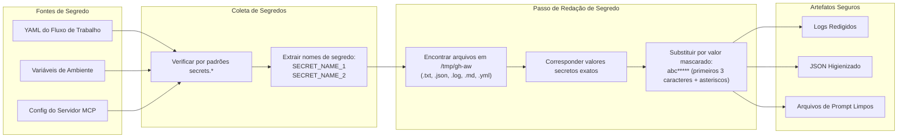

**Propriedades da Redação:**
- **Detecção Automática**: Varre o YAML do fluxo de trabalho por padrões `secrets.*` e coleta todas as referências de segredos
- **Correspondência Exata de String**: Usa correspondência de string segura (não regex) para evitar ataques de injeção
- **Visibilidade Parcial**: Exibe os primeiros 3 caracteres seguidos por asteriscos para depuração sem expor segredos completos
- **Mascaramento Personalizado**: Suporta passos adicionais de mascaramento de segredo personalizado via configuração `secret-masking:`

**Exemplo de Configuração:**

```yaml wrap
secret-masking:
  steps:
    - name: Redigir padrões personalizados
      run: |
        find /tmp/gh-aw -type f -exec sed -i 's/password123/REDACTED/g' {} +
```

A redação de segredo executa com `if: always()` para garantir que os segredos nunca sejam vazados, mesmo se o fluxo de trabalho falhar em um estágio anterior.

## Fluxo de Execução do Job

A execução do fluxo de trabalho segue uma ordem estrita de dependência que impõe verificações de segurança em cada limite de etapa. A decomposição em nível de plano garante que cada etapa tenha entradas e saídas explícitas, e que as transições entre etapas sejam mediadas por passos de validação.

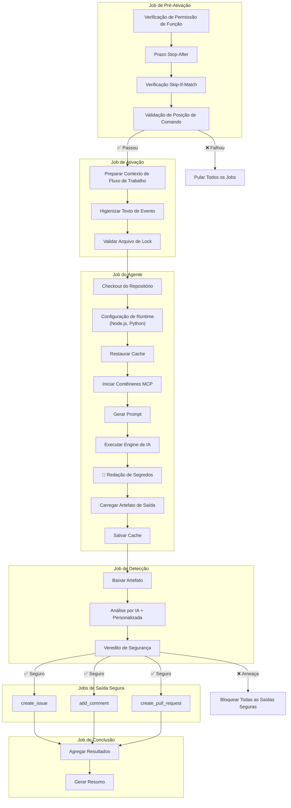

## Observabilidade

O AW fornece observabilidade abrangente através de execuções do GitHub Actions e artefatos. Artefatos de fluxo de trabalho preservam prompts, saídas, patches e logs para análise post-hoc. Essa camada de observabilidade suporta depuração, auditoria de segurança e monitoramento de custos sem comprometer o isolamento em tempo de execução.

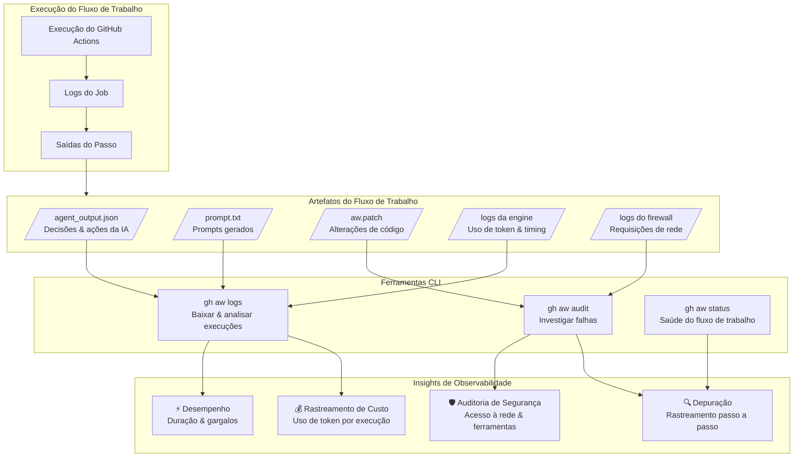

**Propriedades de Observabilidade:**

- **Preservação de Artefatos**: Todas as saídas de fluxo de trabalho (prompts, patches, logs) são salvas como artefatos baixáveis
- **Monitoramento de Custo**: O uso de token e custos entre execuções de fluxo de trabalho são rastreados via `gh aw logs`
- **Análise de Falhas**: Execuções com falha podem ser investigadas com `gh aw audit` para examinar prompts, erros e atividade de rede
- **Logs de Firewall**: Todas as requisições de rede feitas pelo agente são logadas para auditoria de segurança
- **Resumos de Passo**: Resumos ricos em markdown no GitHub Actions exibem decisões e saídas do agente

**Comandos CLI para Observabilidade:**

```bash wrap
# Baixar e analisar logs de execução de fluxo de trabalho
gh aw logs

# Investigar uma execução de fluxo de trabalho específica
gh aw audit <run-id>

# Verificar saúde e status do fluxo de trabalho
gh aw status
```

## Resumo das Camadas de Segurança

| Camada | Mecanismo | Proteção Contra |
|-------|-----------|-------------------|
| **Substrato** | Runner do GitHub Actions (VM, kernel, hipervisor) | Corrupção de memória, escalonamento de privilégio, escape de host |
| **Substrato** | Runtime de contêiner Docker | Bypass de isolamento de processo, acesso a estado compartilhado |
| **Substrato** | Controles de rede AWF (iptables) | Exfiltração de dados, chamadas de API não autorizadas |
| **Substrato** | Sandboxing MCP (isolamento de contêiner) | Escape de contêiner, acesso não autorizado a ferramentas |
| **Configuração** | Validação de schema, lista de permissões de expressão | Configurações inválidas, expressões não autorizadas |
| **Configuração** | Fixação de SHA da Ação | Ataques à cadeia de suprimentos, sequestro de tag |
| **Configuração** | Scanners de segurança (actionlint, zizmor, poutine) | Escalonamento de privilégio, configurações incorretas, riscos de cadeia de suprimentos |
| **Configuração** | Verificações de pré-ativação (função/permissão) | Usuários não autorizados, fluxos de trabalho expirados |
| **Plano** | Filtragem de integridade (`min-integrity`) | Entrada de usuário não confiável, envenenamento de contexto, engenharia social |
| **Plano** | Higienização de conteúdo | Abuso de @mention, gatilhos de bot |
| **Plano** | Redação de segredos | Vazamento de credencial em logs/artefatos |
| **Plano** | Detecção de ameaças | Patches maliciosos, vazamentos de segredo |
| **Plano** | Separação de permissões (SafeOutputs) | Abuso de acesso direto de escrita |
| **Plano** | Higienização de saída | Injeção de conteúdo, XSS |
| **Plano** | Preservação de artefato, ferramentas CLI | Depuração de falhas, auditoria de segurança, rastreamento de custo |

## Documentação Relacionada

- [Filtragem de Integridade](/gh-aw/reference/integrity/) - Filtragem de conteúdo por confiança do autor e status de merge
- [Guia de Detecção de Ameaças](/gh-aw/reference/threat-detection/) - Configurando análise de ameaças
- [Permissões de Rede](/gh-aw/reference/network/) - Controle de acesso à rede
- [Referência de Saídas Seguras](/gh-aw/reference/safe-outputs/) - Configuração de processamento de saída
- [Engines de IA](/gh-aw/reference/engines/) - Recursos de segurança específicos da engine
- [Processo de Compilação](/gh-aw/reference/compilation-process/) - Validação de segurança em tempo de compilação
- [Comandos da CLI](/gh-aw/setup/cli/) - Ferramentas de gerenciamento e observabilidade de fluxo de trabalho
