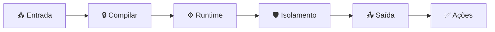

O GitHub Agentic Workflows hospeda agentes de codificação no [GitHub Actions](https://docs.github.com/en/actions), para realizar tarefas complexas e de várias etapas automaticamente. Isso possibilita a [Continuous AI](https://githubnext.com/projects/continuous-ai) - aplicação sistemática e automatizada de IA à colaboração de software.

## Estrutura do Fluxo de Trabalho

Cada fluxo de trabalho contém [frontmatter](/gh-aw/reference/glossary/#frontmatter) (a seção de configuração YAML entre os marcadores `---`) e instruções em markdown. O frontmatter define [gatilhos](/gh-aw/reference/triggers/) (quando o fluxo de trabalho é executado), [permissões](/gh-aw/reference/permissions/) (o que ele pode acessar) e [ferramentas](/gh-aw/reference/tools/) (quais capacidades a IA tem), enquanto o markdown contém descrições de tarefas em linguagem natural. Esta estrutura declarativa permite uma programação agêntica confiável e segura, isolando as capacidades da IA e disparando-as nos momentos certos.

```aw warp
---
on: ...
permissions: ...
tools: ...
---
# Instruções em Linguagem Natural
Analise esta issue e forneça comentários úteis de triagem...
```

## Motores de IA (AI Engines)

Os fluxos de trabalho suportam **GitHub Copilot** (padrão), **Claude da Anthropic**, **Codex** e **Gemini do Google**. Cada [motor](/gh-aw/reference/engines/) (modelo de IA/provedor) interpreta instruções em linguagem natural e as executa usando ferramentas e permissões configuradas.

## Ferramentas e o Model Context Protocol (MCP)

Os fluxos de trabalho usam [ferramentas](/gh-aw/reference/tools/) através do **[Model Context Protocol](/gh-aw/reference/glossary/#mcp-model-context-protocol)** (MCP, um protocolo padronizado para conectar agentes de IA a ferramentas e serviços externos) para operações no GitHub, APIs externas, operações de arquivo e integrações personalizadas.

## Fluxos de Trabalho Agênticos vs. Tradicionais

**Fluxos de trabalho tradicionais** executam etapas pré-programadas com lógica fixa se/então. Eles fazem exatamente o que você manda, sempre, da mesma maneira.

**[Fluxos de trabalho agênticos](/gh-aw/reference/glossary/#agentic)** (fluxos de trabalho que possuem agência — a capacidade de tomar decisões autônomas) usam IA para entender o contexto, tomar decisões e gerar conteúdo interpretando instruções em linguagem natural de forma flexível. Eles combinam a infraestrutura determinística do GitHub Actions com a tomada de decisão impulsionada por IA, adaptando seu comportamento com base na situação específica que encontram.

## Design de Segurança

Os fluxos de trabalho agênticos implementam uma arquitetura de segurança de defesa em profundidade que protege contra injeção de prompt, servidores MCP suspeitos e agentes maliciosos. A arquitetura opera em várias camadas: validação em tempo de compilação, isolamento em tempo de execução, separação de permissões, controles de rede e higienização de saída.



Os fluxos de trabalho são executados com permissões mínimas (sem acesso de escrita por padrão), usam allowlists de ferramentas e processam as saídas através de uma [camada de segurança](/gh-aw/introduction/architecture/) antes de aplicar alterações. Ações críticas podem exigir aprovação humana. Para documentação de segurança detalhada, veja a página [Arquitetura de Segurança](/gh-aw/introduction/architecture/).

## Scripts MCP e Saídas Seguras (Safe Outputs)

- **[Scripts MCP](/gh-aw/reference/mcp-scripts/)** (ferramentas inline personalizadas) - Ferramentas MCP personalizadas definidas inline no frontmatter do fluxo de trabalho
- **[Saídas seguras](/gh-aw/reference/safe-outputs/)** (operações validadas do GitHub) - Ações pré-aprovadas que a IA pode solicitar sem permissões de escrita

## Regenerando o Arquivo de Lock

Use `gh aw compile` para gerar [arquivos `.lock.yml`](/gh-aw/reference/glossary/#workflow-lock-file-lockyml) a partir do frontmatter dos arquivos `.md` do fluxo de trabalho. O arquivo `.md` é a fonte da verdade editável, enquanto o `.lock.yml` é o fluxo de trabalho do GitHub Actions compilado com endurecimento de segurança. Faça commit de ambos os arquivos.

## Padrões de Continuous AI

Habilite padrões de [Continuous AI](https://githubnext.com/projects/continuous-ai) como manter a documentação atualizada, melhorar a qualidade do código incrementalmente, realizar triagem inteligente de issues e PRs e automatizar revisões de código.

## Melhores Práticas

Comece de forma simples e itere com instruções claras e específicas. Teste fluxos de trabalho usando `gh aw compile --watch` e `gh aw run`, monitore custos com `gh aw logs` e revise o conteúdo gerado pela IA antes de mesclar. Use [`saídas seguras`](/gh-aw/reference/safe-outputs/) (operações pré-aprovadas do GitHub) para criação controlada de issues, comentários e PRs.
