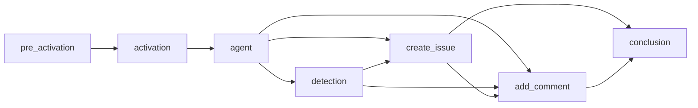
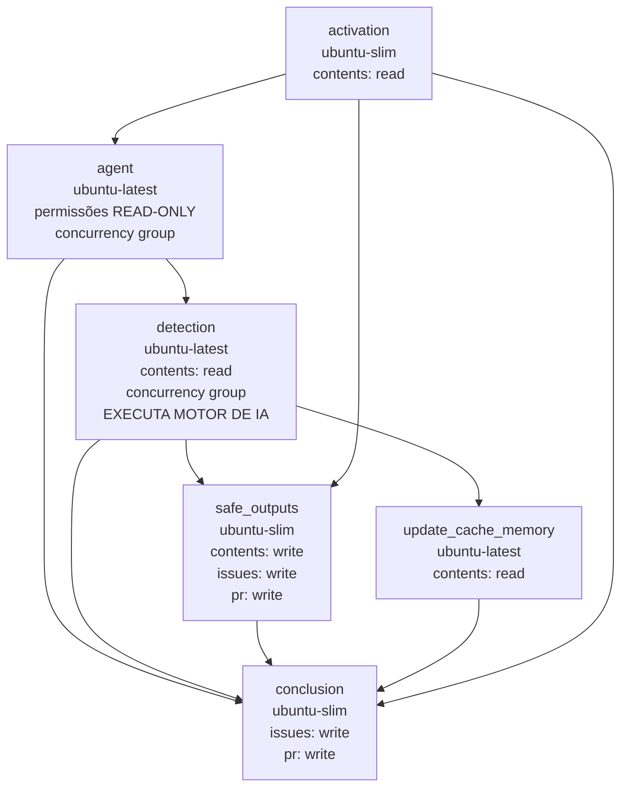

Este guia documenta o processo de compilação interno que transforma arquivos de fluxo de trabalho markdown em YAML executável do GitHub Actions. Entender esse processo ajuda ao depurar fluxos de trabalho, otimizar o desempenho ou contribuir para o projeto.

## Visão geral

O comando `gh aw compile` transforma um arquivo de fluxo de trabalho markdown em um `.lock.yml` completo do GitHub Actions, incorporando frontmatter e configurando o carregamento em tempo de execução do corpo markdown. O processo executa cinco fases de compilação (análise, validação, construção de job, resolução de dependências e geração de YAML) descritas abaixo.

Quando o fluxo de trabalho é executado, o corpo markdown é carregado em tempo de execução — você pode editar instruções sem recompilação. Veja [Editando Fluxos de Trabalho](/gh-aw/guides/editing-workflows/) para detalhes.

## Fases da compilação

### Fase 1: Análise e Validação

O compilador extrai o frontmatter YAML, valida-o em relação ao esquema do fluxo de trabalho, valida a segurança da expressão (permite apenas expressões do GitHub Actions permitidas em lista de permissões) e resolve importações.

#### Resolução de Importações

As importações são resolvidas com uma travessia de largura (BFS) determinística: começando de `imports:` no fluxo de trabalho principal, cada arquivo é carregado, suas configurações são extraídas e quaisquer importações aninhadas são anexadas à fila. Arquivos visitados são rastreados para detectar ciclos.

| Campo | Estratégia de mesclagem |
|-------|----------------|
| Ferramentas | Mesclagem profunda; arrays concatenados e desduplicados |
| Servidores MCP | Servidores importados sobrescrevem servidores do fluxo de trabalho principal com o mesmo nome |
| Rede | União de domínios permitidos, desduplicados e ordenados |
| Permissões | Apenas validação — o principal deve satisfazer requisitos importados |
| Safe outputs | O fluxo de trabalho principal sobrescreve configurações importadas por tipo |
| Runtimes | As versões do fluxo de trabalho principal sobrescrevem versões importadas |

A ordem de processamento segue BFS:

```
Fluxo de Trabalho Principal
├── import-a.md          → Processado 1º
│   ├── nested-1.md      → Processado 3º (após import-b)
│   └── nested-2.md      → Processado 4º
└── import-b.md          → Processado 2º
    └── nested-3.md      → Processado 5º
```

Veja [Referência de Importações](/gh-aw/reference/imports/) para semântica completa de mesclagem.

### Fases 2–5: Construindo o fluxo de trabalho

| Fase | Passos |
|-------|-------|
| **2 Construção do Job** | Constrói jobs especializados: pré-ativação (se necessário), ativação, agente, safe outputs, safe-jobs e jobs personalizados |
| **3 Resolução de dependências** | Valida dependências de job, detecta referências circulares, computa ordem topológica, gera gráfico Mermaid |
| **4 Fixação de Ações** | Fixa todas as ações em SHAs: verificar cache → API do GitHub → pinos incorporados → adicionar comentário de versão (ex: `actions/checkout@sha # v6`) |
| **5 Geração de YAML** | Monta o `.lock.yml` final: cabeçalho com metadados, gráfico de dependência Mermaid, jobs em ordem alfabética, prompt original incorporado |

## Tipos de Job

O processo de compilação gera jobs especializados com base na configuração do fluxo de trabalho:

| Job | Gatilho | Propósito | Principais dependências |
|-----|---------|---------|------------------|
| **pre_activation** | Verificações de função, prazos de parada, skip-if-match ou gatilhos de comando | Valida permissões, prazos e condições antes da execução da IA | Nenhuma (executa primeiro) |
| **activation** | Sempre | Prepara contexto do fluxo de trabalho, saneia texto do evento, valida frescor do arquivo de lock | `pre_activation` (se existir) |
| **agent** | Sempre | Job principal que executa agente de IA com motor configurado, ferramentas e servidores Model Context Protocol (MCP) | `activation` |
| **detection** | `safe-outputs.threat-detection:` configurado | Analisa a saída do agente em busca de ameaças de segurança antes do processamento | `agent` |
| **Jobs de Safe output** | `safe-outputs.*:` configurados | Processa a saída do agente para realizar operações da API do GitHub (criar issues/PRs, adicionar comentários, fazer upload de ativos, etc.) | `agent`, `detection` (se existir) |
| **conclusion** | Sempre (se safe outputs existirem) | Agrega resultados e gera resumo do fluxo de trabalho | Todos os jobs de safe output |

### Etapas do Job do Agente

O job do agente executa: checkout do repositório e configuração de runtime (Node.js, Python, Go) → restauração de cache → inicialização de contêiner MCP → geração de prompt a partir do corpo markdown → execução do motor (Copilot, Claude ou Codex) → upload da saída como artefato do GitHub Actions → persistência de cache. Variáveis de ambiente chave: `GH_AW_PROMPT` (arquivo de prompt), `GH_AW_SAFE_OUTPUTS` (JSON de saída), `GITHUB_TOKEN`.

### Jobs de Safe Output

Cada job de safe output segue o mesmo padrão: faz download do artefato do agente, analisa seu JSON, executa a operação correspondente da API do GitHub com as permissões corretas e faz link para itens relacionados. Tipos disponíveis incluem `create_issue`, `create_discussion`, `add_comment`, `create_pull_request`, `create_pr_review_comment`, `create_code_scanning_alert`, `add_labels`, `assign_milestone`, `update_issue`, `update_release`, `push_to_pr_branch`, `upload_assets`, `update_project`, `missing_tool` e `noop`.

### Jobs Personalizados

Use `safe-outputs.jobs:` para jobs personalizados com sintaxe completa do GitHub Actions, ou `jobs:` para jobs de fluxo de trabalho adicionais com dependências definidas pelo usuário. Veja [DeterministicOps](/gh-aw/patterns/deterministic-ops/) para exemplos de fluxos de trabalho de múltiplos estágios combinando computação determinística com raciocínio de IA.

## Gráficos de dependência de job

Jobs executam em ordem topológica com base em dependências. Aqui está um exemplo abrangente:



**Fluxo de execução**: Pré-ativação valida permissões → Ativação prepara contexto → Agente executa IA → Detecção analisa saída → Safe outputs executam em paralelo → Adicionar comentário espera itens criados → Conclusão resume resultados. Jobs de safe output sem dependências cruzadas executam simultaneamente; quando a detecção de ameaças está habilitada, safe outputs dependem tanto dos jobs de agente quanto de detecção.

## Por que Detecção, Safe Outputs e Conclusão são Jobs Separados

Um fluxo de trabalho compilado típico contém estes jobs pós-agente:



Esses três jobs formam um **pipeline de segurança sequencial** enraizado em [Confiança em Nível de Plano](/gh-aw/introduction/architecture/) — o raciocínio de IA (somente leitura) é separado das operações de escrita. Eles não podem ser mesclados porque as permissões do GitHub Actions são por job e imutáveis durante a duração de um job:

| Job | Principais permissões | Justificativa |
|-----|----------------|-----------|
| **detection** | `contents: read` | Executa análise de IA — não deve ter acesso de escrita |
| **safe_outputs** | `contents: write`, `issues: write`, `pull-requests: write` | Executa operações de escrita da API do GitHub |
| **conclusion** | `issues: write`, `pull-requests: write`, `discussions: write` | Atualiza comentários, trata falhas |

Um job combinado teria permissões de escrita enquanto executa a detecção de ameaças, frustrando o privilégio mínimo e permitindo que um agente comprometido contorne o bloqueio. O isolamento em nível de job também permite:

- **Bloqueio rígido.** A condição `needs.detection.outputs.success == 'true'` no job `safe_outputs` impede que o executor inicie completamente se a detecção falhar. Verificações `if` em nível de etapa dentro de um único job são mais fracas.
- **Semântica `always()` para `conclusion`.** Ele inspeciona resultados a montante via `needs.agent.result` para registrar erros e relatar ferramentas ausentes mesmo quando as escritas falham.
- **Executores de tamanho adequado.** A detecção precisa de `ubuntu-latest` para execução de IA; safe_outputs e conclusion usam o `ubuntu-slim` leve.
- **Isolamento de concorrência.** A detecção compartilha um grupo de concorrência com o job do agente para serializar a execução da IA; safe_outputs intencionalmente não compartilha, para que possa executar ao lado das fases de detecção de outros fluxos de trabalho.
- **Transferência baseada em artefato.** O agente escreve `agent_output.json`; a detecção emite `success`; safe_outputs só baixa o artefato se aprovado. Um sistema de arquivos compartilhado em um único job permitiria a violação da saída entre as fases.

## Fixação de Ações (Action Pinning)

Todas as Ações do GitHub são fixadas em SHAs de commit (ex: `actions/checkout@b4ffde6...11 # v6`) para se defender contra ataques à cadeia de suprimentos — tags podem ser movidas, SHAs não podem. A ordem de resolução é cache (`.github/aw/actions-lock.json`) → API do GitHub → pinos incorporados.

### O cache actions-lock.json

`.github/aw/actions-lock.json` armazena mapeamentos resolvidos de `action@version` → SHA para que a compilação produza resultados consistentes independentemente do token disponível. Resolver uma tag para um SHA requer acesso à API do GitHub, que falha sob tokens restritos — notadamente o token do Agente de Codificação GitHub Copilot (CCA). Com o cache, CCA e ambientes restritos semelhantes reutilizam SHAs de uma execução de compilação anterior com um token de escopo mais amplo.

**Confirme `actions-lock.json` no controle de versão** para que todos os colaboradores e ferramentas automatizadas usem os mesmos pinos imutáveis. Atualize com `gh aw update-actions`, ou exclua e recompile com um token permissivo para forçar a re-resolução completa.

## O repositório gh-aw-actions

`github/gh-aw-actions` contém as ações reutilizáveis que alimentam fluxos de trabalho compilados. Cada etapa de ação em um `.lock.yml` gerado referencia-o (geralmente por SHA de commit, ocasionalmente por uma tag estável como `v0` quando a resolução de SHA não está disponível):

```yaml
uses: github/gh-aw-actions/setup@abc1234...
```

Nunca edite essas referências manualmente — execute `gh aw compile` ou `gh aw update-actions` para regenerá-las. Use `--actions-repo` (com `--action-mode action`) para compilar contra um fork ou tag específica durante o desenvolvimento; veja [Comandos de Compilação](#compilation-commands).

### Dependabot e gh-aw-actions

O Dependabot pode abrir PRs para atualizar `github/gh-aw-actions` para um SHA mais novo. **Não as mescle** — atualizações de pin devem vir de `gh aw compile`, que coordena pinos em todos os fluxos de trabalho compilados a partir de um único release. `gh aw compile` insere automaticamente uma regra de ignorar quando um bloco de atualização `github-actions` existe em `.github/dependabot.yml`. Ao habilitar o Dependabot do zero, use:

```yaml
updates:
  - package-ecosystem: github-actions
    directory: "/.github/workflows"
    ignore:
      - dependency-name: "github/gh-aw-actions/**" # Gerenciado por gh aw compile. Bloqueado na versão do compilador gh-aw; não atualizar.
```

## Artefatos Criados

Fluxos de trabalho geram vários artefatos durante a execução:

| Artefato | Localização | Propósito | Ciclo de vida |
|----------|----------|---------|-----------|
| **agent_output.json** | `/tmp/gh-aw/safeoutputs/` | Saída do agente de IA com dados estruturados de safe output (create_issue, add_comment, etc.) | Enviado pelo job do agente, baixado pelos jobs de safe output, auto-excluído após 90 dias |
| **agent_usage.json** | `/tmp/gh-aw/` | Contagens agregadas de tokens: `{"input_tokens":…,"output_tokens":…,"cache_read_tokens":…,"cache_write_tokens":…}` | Agrupado no artefato unificado do agente quando o firewall está habilitado; acessível a ferramentas de terceiros sem analisar resumos de etapa |
| **prompt.txt** | `/tmp/gh-aw/aw-prompts/` | Prompt gerado enviado ao agente de IA (inclui instruções markdown, importações, variáveis de contexto) | Retido para depuração e reprodução |
| **firewall-audit-logs** | Veja estrutura abaixo | Artefato dedicado para logs de auditoria/observabilidade do AWF (uso de token, política de rede, rastro de auditoria) | Enviado por todos os fluxos de trabalho com firewall habilitado; analisado por `gh aw logs --artifacts firewall` |
| **firewall-logs/** | `/tmp/gh-aw/sandbox/firewall/logs/` | Logs de acesso de rede em formato Squid (quando `network.firewall:` habilitado) | Analisado pelo comando `gh aw logs` |
| **cache-memory/** | `/tmp/gh-aw/cache-memory/` | Memória persistente do agente entre execuções (quando `tools.cache-memory:` configurado) | Restaurado no início, salvo no final via cache do GitHub Actions |
| **patches/**, **sarif/**, **metadata/** | Vários | Dados de safe output (git patches, arquivos SARIF, JSON de metadados) | Temporário, limpo após o processamento |

### Estrutura do artefato firewall-audit-logs

O artefato `firewall-audit-logs` é um artefato multi-arquivo dedicado enviado por todos os fluxos de trabalho com firewall habilitado. Ele é **separado** do artefato `agent` unificado. Fluxos de trabalho downstream que precisam de dados de uso de token ou logs de auditoria de firewall devem baixar este artefato especificamente.

```
firewall-audit-logs/
├── api-proxy-logs/
│   └── token-usage.jsonl        ← Dados de uso de token por solicitação
├── squid-logs/
│   └── access.log               ← Log de política de rede (permitir/negar)
├── audit.jsonl                  ← Rastro de auditoria do firewall
└── policy-manifest.json         ← Snapshot da configuração de política
```

> **Dica:** Use `gh aw logs <run-id> --artifacts firewall` para baixar e analisar dados de firewall em vez de `gh run download` diretamente. A CLI manipula a nomenclatura de artefatos e compatibilidade retroativa automaticamente. Veja a referência de [Artefatos](/gh-aw/reference/artifacts/) para o guia completo de nomenclatura de artefatos.

## Integração de Servidor MCP

Servidores do Model Context Protocol (MCP) fornecem ferramentas para agentes de IA. A compilação emite `mcp-config.json` a partir da configuração de ferramentas do fluxo de trabalho. Servidores locais executam em contêineres Docker com Dockerfiles gerados automaticamente e conectam-se via stdio; servidores HTTP conectam-se diretamente com cabeçalhos e autenticação configurados. `allowed:` restringe quais ferramentas o agente vê, e secrets são injetados através de variáveis de ambiente do Dockerfile (local) ou referências de configuração (HTTP). Em tempo de execução, contêineres MCP iniciam após a configuração de runtime, o motor executa com acesso à ferramenta, então os contêineres param.

## Job de Pré-ativação

A pré-ativação executa verificações de bloqueio sequencialmente antes de qualquer execução de IA. Qualquer falha define `activated=false`, pulando jobs downstream e economizando custos:

- **Verificações de função** (`roles:`) — o ator tem permissão de admin/maintainer/escrita
- **Prazo de parada** (`on.stop-after:`) — fluxo de trabalho não ultrapassou seu prazo (ex: `+30d`, `2024-12-31`)
- **Skip-if-match** (`skip-if-match:`) — nenhum item existente corresponde aos critérios de dedup
- **Posição do comando** (`on.slash_command:`) — o comando slash aparece nas primeiras 3 linhas

## Comandos de Compilação

| Comando | Descrição |
|---------|-------------|
| `gh aw compile` | Compilar todos os fluxos de trabalho em `.github/workflows/` |
| `gh aw compile meu-fluxo-de-trabalho` | Compilar fluxo de trabalho específico |
| `gh aw compile --verbose` | Habilitar saída detalhada |
| `gh aw compile --strict` | Validação de segurança aprimorada |
| `gh aw compile --no-emit` | Validar sem gerar arquivos |
| `gh aw compile --actionlint --zizmor --poutine` | Executar escaneadores de segurança |
| `gh aw compile --purge` | Remover arquivos `.lock.yml` órfãos |
| `gh aw compile --output /caminho/para/saida` | Diretório de saída personalizado |
| `gh aw compile --action-mode action --actions-repo proprietario/repo` | Compilar usando um repositório de ações personalizado (requer `--action-mode action`) |
| `gh aw compile --action-mode action --actions-repo proprietario/repo --action-tag branch-ou-sha` | Compilar contra uma branch ou SHA específica em um fork |
| `gh aw compile --action-tag v1.2.3` | Fixar referências de ação em uma tag ou SHA específica (implica modo release) |
| `gh aw validate` | Validar todos os fluxos de trabalho (compilar + todos os linters, sem saída de arquivo) |
| `gh aw validate meu-fluxo-de-trabalho` | Validar um fluxo de trabalho específico |
| `gh aw validate --json` | Validar e enviar resultados em formato JSON |
| `gh aw validate --strict` | Validar com modo estrito imposto |

> [!TIP]
> A compilação só é necessária ao alterar a **configuração de frontmatter**. O **corpo markdown** (instruções de IA) é carregado em tempo de execução e pode ser editado sem recompilação. Veja [Editando Fluxos de Trabalho](/gh-aw/guides/editing-workflows/) para detalhes.

> [!NOTE]
> A flag `--actions-repo` sobrescreve o repositório `github/gh-aw-actions` padrão usado quando `--action-mode action` está definido. Use-a juntamente com `--action-tag` para compilar contra uma branch ou fork durante o desenvolvimento.

## Depurando a Compilação

Execute `DEBUG=workflow:* gh aw compile meu-fluxo-de-trabalho --verbose` para rastrear a criação de jobs, resolução de pin de ação, configuração de ferramenta e configuração de MCP. Inspecione os arquivos `.lock.yml` gerados para comentários de cabeçalho, gráfico de dependência Mermaid, estrutura de job, pinos de SHA e configuração de MCP. Correções comuns: dependências circulares → revise cláusulas `needs:`; pino de ação ausente → adicione a `action_pins.json` ou habilite resolução dinâmica; configuração MCP inválida → verifique `command`, `args`, `env`.

## Desempenho

Fluxos de trabalho simples compilam em ~100ms; fluxos de trabalho com importações em ~500ms; fluxos de trabalho que resolvem SHAs de ação dinamicamente em ~2s. Para manter a compilação rápida, confirme `.github/aw/actions-lock.json` e minimize a profundidade de importação. Em tempo de execução, jobs de safe output sem dependências cruzadas executam em paralelo; habilite `cache:` e `cache-memory:` para acelerações adicionais.

## Tópicos Avançados

- **Motores personalizados**: implemente um motor que retorna etapas do GitHub Actions e acesso à ferramenta, então registre-o com o framework.
- **Extensão de esquema**: adicione campos de frontmatter atualizando o esquema do fluxo de trabalho, reconstruindo (`make build`) e conectando o tratamento do analisador.
- **Manifesto de fluxo de trabalho**: arquivos importados são rastreados em cabeçalhos de arquivo de bloqueio para detecção de atualização e rastros de auditoria.

## Documentação relacionada

- [Editando Fluxos de Trabalho](/gh-aw/guides/editing-workflows/) - Quando recompilar vs editar diretamente
- [Referência de Frontmatter](/gh-aw/reference/frontmatter/) - Todas as opções de configuração
- [Referência de Ferramentas](/gh-aw/reference/tools/) - Guia de configuração de ferramenta
- [Referência de Safe Outputs](/gh-aw/reference/safe-outputs/) - Processamento de saída
- [Referência de Motores](/gh-aw/reference/engines/) - Configuração de motor de IA
- [Referência de Rede](/gh-aw/reference/network/) - Permissões de rede
